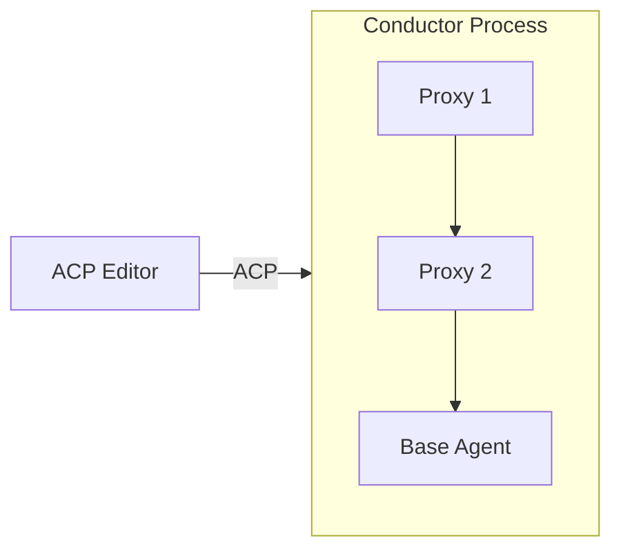

# SACP: Symposium's Extensions to ACP

**SACP** is an SDK for building composable AI agent systems using the [Agent-Client Protocol](https://agentclientprotocol.com/).

## What is SACP?

SACP extends ACP to enable **composable agent architectures through proxy chains**. Instead of building monolithic AI tools, SACP allows you to create modular components that can intercept and transform messages flowing between editors and agents.



## Repository Structure

This repository contains three core crates:

- **[`sacp`](./src/sacp/)** - Core protocol types and traits for building clients and agents
- **[`sacp-proxy`](./src/sacp-proxy/)** - Framework for building proxy components
- **[`sacp-conductor`](./src/sacp-conductor/)** - Binary that orchestrates proxy chains

## Documentation

Full documentation is available in the [mdbook](https://rust-lang.github.io/mdBook/):

```bash
mdbook serve
```

Then visit http://localhost:3000

Key chapters:
- [Introduction](./md/introduction.md) - What is SACP and why use it
- [Architecture Overview](./md/architecture.md) - How proxy chains work
- [Protocol Reference](./md/protocol.md) - Technical protocol details

## Quick Start

### Using as a Library

Add to your `Cargo.toml`:

```toml
[dependencies]
sacp = "0.1"           # Core protocol types
sacp-proxy = "0.1"     # For building proxies
```

### Building the Conductor

```bash
cargo build --release -p sacp-conductor
```

The conductor binary will be at `target/release/sacp-conductor`.

### Running a Proxy Chain

```bash
# Start a proxy chain with two components
sacp-conductor agent proxy-component-1 proxy-component-2 base-agent
```

The conductor presents as a normal ACP agent to editors while orchestrating the proxy chain internally.

## Example Use Case: Sparkle Integration

The [sparkle-acp-proxy](https://github.com/nikomatsakis/sparkle-acp-proxy) demonstrates a real-world SACP proxy that:

1. Injects Sparkle's MCP server during initialization
2. Prepends embodiment sequences to prompts
3. Provides collaborative AI patterns transparently

## Development

### Building

```bash
cargo build
```

### Testing

```bash
cargo test
```

### Running Examples

See the test files in each crate for usage examples.

## Design Documentation

The `md/` directory contains detailed design documentation extracted from the Symposium project:

- [proxying-acp.md](./md/proxying-acp.md) - Complete RFD with protocol specification
- [pacp-components.md](./md/pacp-components.md) - Component architecture overview
- [conductor.md](./md/conductor.md) - Conductor implementation details

## Relationship to ACP

SACP is an [extension to ACP](https://agentclientprotocol.com/protocol/extensibility), not a fork. SACP components communicate using ACP's extension protocol (`_meta` fields and custom methods). Standard ACP editors and agents work with SACP without modification.

## License

MIT OR Apache-2.0

## Contributing

This repository will be upstreamed to the `agent-client-protocol` organization. Contributions welcome!
