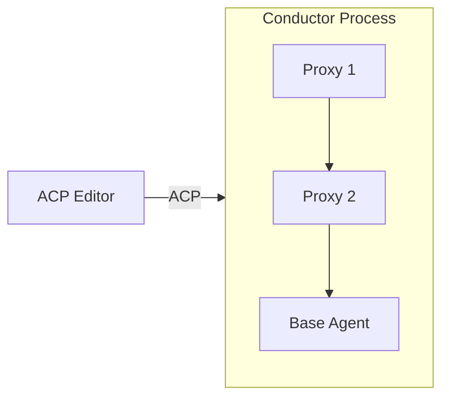

# SACP: Symposium Agent Client Protocol SDK

This repository houses the **Symposium ACP SDK**, which aims to:

1. **Provide a nicer SDK for working with ACP in general** - Type-safe, async-first, and easy to use for building agents and editors
2. **Support proxy components for composable extensions** - Build modular components that extend agent behavior without modifying the agent itself

Instead of building monolithic AI tools, SACP enables **composable agent architectures through proxy chains** where functionality can be added, removed, or reconfigured dynamically.

## Repository Structure

This repository contains several crates:

**Core SDK:**
- **[`sacp`](./src/sacp/)** - Core ACP SDK for building agents and editors in Rust
- **[`sacp-tokio`](./src/sacp-tokio/)** - Tokio-specific utilities (process spawning, connection management)

**Proxy Framework:**
- **[`sacp-proxy`](./src/sacp-proxy/)** - Framework for building ACP proxy components
- **[`sacp-conductor`](./src/sacp-conductor/)** - Binary that orchestrates proxy chains

**Examples & Testing:**
- **[`elizacp`](./src/elizacp/)** - Example ACP agent implementing the classic Eliza chatbot (useful for testing)

## Documentation

Full documentation is available in the [mdbook](https://rust-lang.github.io/mdBook/). You can browse the latest version on [our Github pages site](https://symposium-acp.github.io/symposium-acp/).
