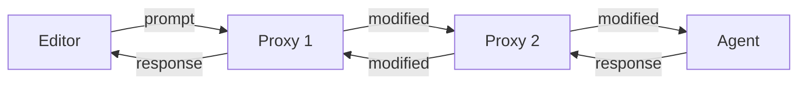
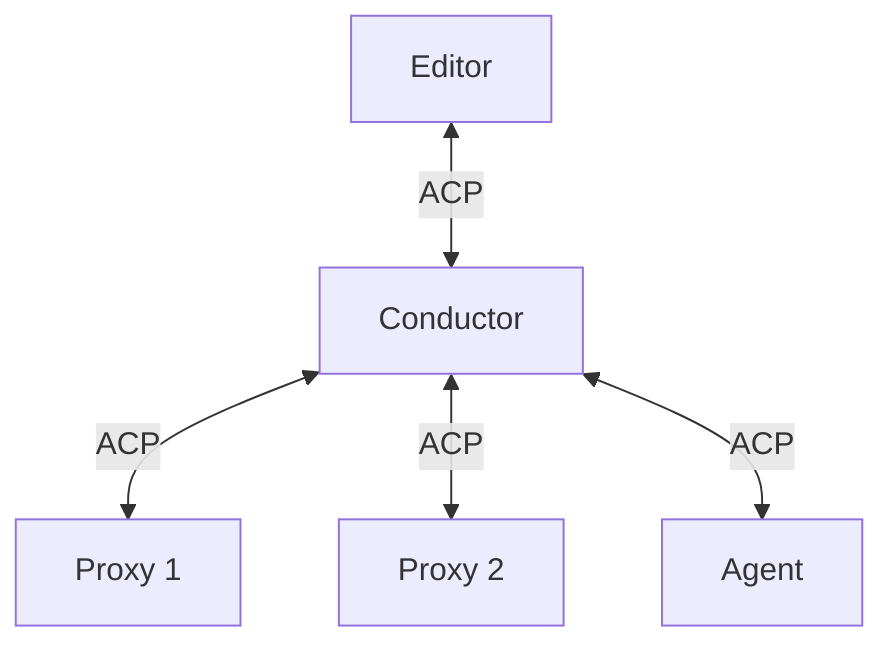

# Architecture Overview

SACP enables composable agent systems through a **proxy chain architecture**. This chapter explains how the components work together.

## Core Concepts

### Proxy Chain

A proxy chain is a sequence of components where each can intercept and transform messages.

#### Conceptual Flow

Conceptually, the chain looks like a sequence where messages flow through each component:



This is the mental model: Editor → Proxy 1 → Proxy 2 → Agent, with responses flowing back.

#### Actual Flow

In reality, the **conductor sits between every component**. Each component only talks to the conductor:



The conductor uses `_proxy/successor/request` bidirectionally with different meanings:
- **Proxy → Conductor**: Proxy sends `_proxy/successor/request` to send a message TO its successor (downstream)
- **Conductor → Proxy**: Conductor sends `_proxy/successor/request` to deliver a message FROM the successor (upstream)

**Important**: The conductor maintains message ordering by routing all forwarding decisions through a central event loop, preventing responses from overtaking notifications even though they use different transport paths.

**Downstream flow (Proxy 1 sending to Proxy 2):**
1. Conductor sends normal ACP request to Proxy 1
2. Proxy 1 sends `_proxy/successor/request` to conductor (meaning "send this TO my successor")
3. Conductor unwraps and forwards inner content to Proxy 2 as normal ACP request

**Upstream flow (Proxy 2 sending agent-to-client message back to Proxy 1):**
1. Proxy 2 sends normal ACP request/notification to conductor (agent-to-client direction)
2. Conductor wraps it in `_proxy/successor/request` and sends to Proxy 1 (meaning "this is FROM your successor")
3. Proxy 1 receives the message, processes it, can forward further upstream to conductor

**Each proxy can:**
- Modify messages before forwarding to successor
- Generate responses without forwarding
- Add side effects (logging, metrics, etc.)
- Pass messages through transparently

### The Conductor

The **conductor** is the orchestrator that manages the proxy chain. From the editor's perspective, it appears as a normal ACP agent.

**Responsibilities:**
1. **Process Management**: Spawns and manages component processes
2. **Message Routing**: Routes messages through the proxy chain, preserving send order
3. **Capability Adaptation**: Bridges between different component capabilities
4. **Message Ordering**: Ensures all messages maintain send order when forwarded through proxy chains

**Usage:**
```bash
# Start a proxy chain
conductor agent sparkle-proxy claude-code-acp

# The editor just sees "conductor" as a normal ACP agent
```

The conductor:
- Spawns each component as a subprocess
- Performs the proxy capability handshake
- Routes messages using the `_proxy/successor/*` protocol
- Handles component failures gracefully

### Proxy Components

Proxies are built using the `sacp-proxy` framework. They communicate with the conductor using special extension methods.

**Proxy Lifecycle:**

1. **Initialization**: Conductor offers proxy capability, component accepts
2. **Message Handling**: Component receives ACP messages from upstream (editor direction)
3. **Forwarding**: Component sends transformed messages downstream using `_proxy/successor/*`
4. **Responses**: Conductor delivers responses/notifications from downstream

**Transparent Proxy Pattern:**

The simplest proxy just forwards everything:

```rust
match message {
    // Forward requests from editor to successor
    AcpRequest(req) => send_to_successor_request(req),
    
    // Forward from successor back to editor
    SuccessorReceiveRequest(msg) => respond_to_editor(msg),
}
```

**Message Transformation:**

A proxy can transform messages before forwarding:

```rust
match message {
    AcpRequest::Prompt(mut prompt) => {
        // Inject context into the prompt
        prompt.messages.insert(0, embodiment_message);
        send_to_successor_request(prompt);
    }
    // ... handle other messages
}
```

### Agent Components

The last component in the chain is the **agent** - a standard ACP agent that provides the base AI model behavior.

Agents:
- Don't need SACP awareness
- Receive normal ACP messages
- Don't know they're in a proxy chain
- Can be any ACP-compatible agent (Claude Code, other implementations)

## Message Flow

### Request Flow (Editor → Agent)

Let's trace a `prompt` request through the chain: Editor → Proxy 1 → Proxy 2 → Agent

1. **Editor → Conductor**: Editor sends normal ACP request `prompt` to conductor via stdio
2. **Conductor → Proxy 1**: Conductor forwards as normal ACP `prompt` message to Proxy 1
3. **Proxy 1 processing**: Proxy 1 receives the request, modifies it, decides to forward
4. **Proxy 1 → Conductor**: Proxy 1 sends `_proxy/successor/request` containing the modified `prompt` back to conductor
5. **Conductor → Proxy 2**: Conductor unwraps the `_proxy/successor/request` and forwards the inner `prompt` as normal ACP to Proxy 2
6. **Proxy 2 → Conductor**: Proxy 2 sends `_proxy/successor/request` with its modified `prompt`
7. **Conductor → Agent**: Conductor unwraps and forwards as normal ACP `prompt` to agent (no proxy capability offered to agent)
8. **Agent processing**: Agent processes the request and generates a response

### Response Flow (Agent → Editor)

Responses flow back via standard JSON-RPC response mechanism:

1. **Agent → Conductor**: Agent sends JSON-RPC response (with matching message ID) via stdio
2. **Conductor → Proxy 2**: Conductor routes response back to Proxy 2 (which sent the original `_proxy/successor/request`)
3. **Proxy 2 processing**: Proxy 2 receives response, can modify it
4. **Proxy 2 → Conductor**: Proxy 2 sends JSON-RPC response (with matching ID) back
5. **Conductor → Proxy 1**: Conductor routes to Proxy 1
6. **Proxy 1 → Conductor**: Proxy 1 sends response
7. **Conductor → Editor**: Conductor forwards final response to editor

**Key insight**: Responses don't use `_proxy/successor/*` wrappers. They use standard JSON-RPC response IDs to route back through the chain.

### Proxy Mode

The conductor can itself be initialized as a proxy component. When the conductor receives an `initialize` request **with** the `proxy` capability:

1. **Conductor runs in proxy mode**: All managed components (including the last one) are offered proxy capability
2. **Final component forwards**: When the last component sends `_proxy/successor/request`, the conductor forwards that message to **its own successor** using `_proxy/successor/request`
3. **Tree structures**: This enables hierarchical proxy chains where a conductor manages a sub-chain within a larger chain

Example tree:
```
client → proxy1 → conductor (proxy mode) → final-agent
                      ↓ manages
                  p1 → p2 → p3
```

When p3 sends `_proxy/successor/request`, the conductor forwards it to `final-agent` (the conductor's successor).

### Key Properties

- **Conductor is always the intermediary**: No component talks directly to another
- **Transparency**: Editor only sees conductor, agent only sees normal ACP
- **Composability**: Proxies don't need to know about each other
- **Flexibility**: Can add/remove/reorder proxies without code changes
- **Compatibility**: Works with any ACP editor and agent
- **Hierarchical**: Conductors can nest via proxy mode

## Capability Handshake

The conductor uses a two-way capability handshake to ensure components can fulfill their role.

### Normal Mode (Conductor as Root)

When the conductor is the root of the chain (not offered proxy capability):

**For Proxy Components (all except last):**

1. Conductor sends `InitializeRequest` with `"_meta": { "proxy": true }`
2. Component must respond with `InitializeResponse` with `"_meta": { "proxy": true }`
3. If component doesn't accept, conductor fails with error

**For Agent (last component):**

1. Conductor sends normal `InitializeRequest` (no proxy capability)
2. Agent responds normally
3. Agent doesn't need SACP awareness

### Proxy Mode (Conductor as Proxy)

When the conductor receives `initialize` **with** proxy capability, it runs in proxy mode:

**For All Components (including last):**

1. Conductor sends `InitializeRequest` with `"_meta": { "proxy": true }` to **all** components
2. Each component must respond with `InitializeResponse` with `"_meta": { "proxy": true }`
3. The final component can now send `_proxy/successor/request` to the conductor
4. Conductor forwards these requests to **its own successor** using `_proxy/successor/request`

This enables tree-structured proxy chains where conductors manage sub-chains.

## MCP Bridge

SACP includes a bridge that allows proxy components to provide MCP servers that communicate over ACP messages.

**Problem**: MCP servers traditionally use stdio. Components want to provide tools without requiring stdio connections.

**Solution**: MCP-over-ACP protocol using `_mcp/*` extension methods.

**How it works:**

1. Component declares MCP server with ACP transport: `"url": "acp:UUID"`
2. If agent supports `mcp_acp_transport`, conductor passes through
3. If not, conductor spawns `conductor mcp PORT` bridge processes
4. Bridge converts between stdio (MCP) and ACP messages
5. Agent thinks it's talking to normal MCP server over stdio

See [Protocol Reference](./protocol.md) for detailed message formats.

## Component Types Summary

| Component | Role | SACP Awareness | Communication |
|-----------|------|----------------|---------------|
| Editor | User interface | No | Standard ACP with conductor |
| Conductor (normal mode) | Orchestrator | Yes | Routes messages between components, sits in the middle of all connections |
| Conductor (proxy mode) | Proxy + Orchestrator | Yes | Routes messages for sub-chain AND forwards final component's messages to its own successor |
| Proxy | Transform messages | Yes | Receives ACP, sends `_proxy/successor/*` to conductor |
| Agent | AI model | No | Standard ACP |

## Benefits of This Architecture

1. **Modularity**: Build focused components that do one thing well
2. **Reusability**: Same proxy works with any editor and agent
3. **Testability**: Test proxies in isolation
4. **Compatibility**: No changes needed to editors or agents
5. **Composition**: Combine components in different ways for different use cases
6. **Evolution**: Add new capabilities without modifying existing components

## Next Steps

- See [Protocol Reference](./protocol.md) for technical details of the `_proxy/successor/*` protocol
- Read [Building a Proxy](./building-proxy.md) to create your first component
- Check [Building an Agent](./building-agent.md) to understand agent development
