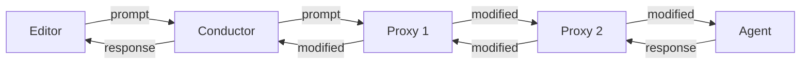

# Architecture Overview

SACP enables composable agent systems through a **proxy chain architecture**. This chapter explains how the components work together.

## Core Concepts

### Proxy Chain

A proxy chain is a sequence of components where each can intercept and transform messages:



Messages flow through the chain in both directions:
- **Downstream**: Editor → Proxies → Agent
- **Upstream**: Agent → Proxies → Editor

Each proxy can:
- Modify the message before passing it on
- Generate responses without forwarding
- Add side effects (logging, metrics, etc.)
- Pass messages through transparently

### The Conductor

The **conductor** is the orchestrator that manages the proxy chain. From the editor's perspective, it appears as a normal ACP agent.

**Responsibilities:**
1. **Process Management**: Spawns and manages component processes
2. **Message Routing**: Routes messages through the proxy chain
3. **Capability Adaptation**: Bridges between different component capabilities

**Usage:**
```bash
# Start a proxy chain
conductor agent sparkle-proxy claude-code-acp

# The editor just sees "conductor" as a normal ACP agent
```

The conductor:
- Spawns each component as a subprocess
- Performs the proxy capability handshake
- Routes messages using the `_proxy/successor/*` protocol
- Handles component failures gracefully

### Proxy Components

Proxies are built using the `sacp-proxy` framework. They communicate with the conductor using special extension methods.

**Proxy Lifecycle:**

1. **Initialization**: Conductor offers proxy capability, component accepts
2. **Message Handling**: Component receives ACP messages from upstream (editor direction)
3. **Forwarding**: Component sends transformed messages downstream using `_proxy/successor/*`
4. **Responses**: Conductor delivers responses/notifications from downstream

**Transparent Proxy Pattern:**

The simplest proxy just forwards everything:

```rust
match message {
    // Forward requests from editor to successor
    AcpRequest(req) => send_to_successor_request(req),
    
    // Forward from successor back to editor
    SuccessorReceiveRequest(msg) => respond_to_editor(msg),
}
```

**Message Transformation:**

A proxy can transform messages before forwarding:

```rust
match message {
    AcpRequest::Prompt(mut prompt) => {
        // Inject context into the prompt
        prompt.messages.insert(0, embodiment_message);
        send_to_successor_request(prompt);
    }
    // ... handle other messages
}
```

### Agent Components

The last component in the chain is the **agent** - a standard ACP agent that provides the base AI model behavior.

Agents:
- Don't need SACP awareness
- Receive normal ACP messages
- Don't know they're in a proxy chain
- Can be any ACP-compatible agent (Claude Code, other implementations)

## Message Flow

### Editor → Agent (Downstream)

1. Editor sends ACP request to conductor (e.g., `prompt`)
2. Conductor forwards as normal ACP message to first proxy
3. Proxy processes, sends `_proxy/successor/send/request` to conductor
4. Conductor routes to next component, repeats until reaching agent
5. Agent processes and generates response

### Agent → Editor (Upstream)

1. Agent sends ACP response
2. Conductor wraps as `_proxy/successor/receive/*` to last proxy
3. Proxy processes, sends result back to conductor
4. Conductor routes to previous proxy, repeats until reaching first
5. First proxy's response goes directly to editor

### Key Properties

- **Transparency**: Editor only sees conductor, agent only sees normal ACP
- **Composability**: Proxies don't need to know about each other
- **Flexibility**: Can add/remove/reorder proxies without code changes
- **Compatibility**: Works with any ACP editor and agent

## Capability Handshake

The conductor uses a two-way capability handshake to ensure components can fulfill their role:

**For Proxy Components:**

1. Conductor sends `InitializeRequest` with `"_meta": { "proxy": true }`
2. Component must respond with `InitializeResponse` with `"_meta": { "proxy": true }`
3. If component doesn't accept, conductor fails with error

**For Agent (last component):**

1. Conductor sends normal `InitializeRequest` (no proxy capability)
2. Agent responds normally
3. Agent doesn't need SACP awareness

This ensures proxies can handle the `_proxy/successor/*` protocol before the chain starts operating.

## MCP Bridge

SACP includes a bridge that allows proxy components to provide MCP servers that communicate over ACP messages.

**Problem**: MCP servers traditionally use stdio. Components want to provide tools without requiring stdio connections.

**Solution**: MCP-over-ACP protocol using `_mcp/*` extension methods.

**How it works:**

1. Component declares MCP server with ACP transport: `"url": "acp:UUID"`
2. If agent supports `mcp_acp_transport`, conductor passes through
3. If not, conductor spawns `conductor mcp PORT` bridge processes
4. Bridge converts between stdio (MCP) and ACP messages
5. Agent thinks it's talking to normal MCP server over stdio

See [Protocol Reference](./protocol.md) for detailed message formats.

## Component Types Summary

| Component | Role | SACP Awareness | Communication |
|-----------|------|----------------|---------------|
| Editor | User interface | No | Standard ACP with conductor |
| Conductor | Orchestrator | Yes | Manages proxy chain |
| Proxy | Transform messages | Yes | `_proxy/successor/*` protocol |
| Agent | AI model | No | Standard ACP |

## Benefits of This Architecture

1. **Modularity**: Build focused components that do one thing well
2. **Reusability**: Same proxy works with any editor and agent
3. **Testability**: Test proxies in isolation
4. **Compatibility**: No changes needed to editors or agents
5. **Composition**: Combine components in different ways for different use cases
6. **Evolution**: Add new capabilities without modifying existing components

## Next Steps

- See [Protocol Reference](./protocol.md) for technical details of the `_proxy/successor/*` protocol
- Read [Building a Proxy](./building-proxy.md) to create your first component
- Check [Building an Agent](./building-agent.md) to understand agent development
