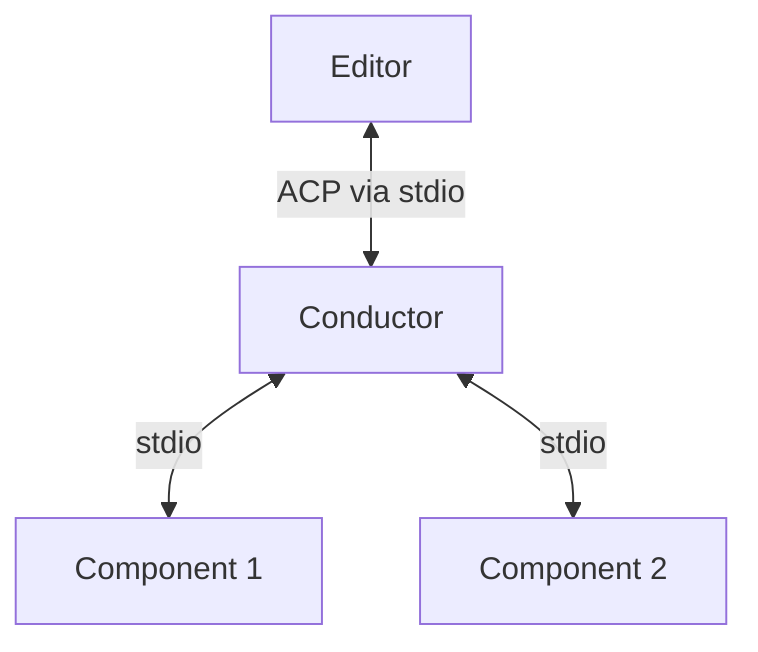
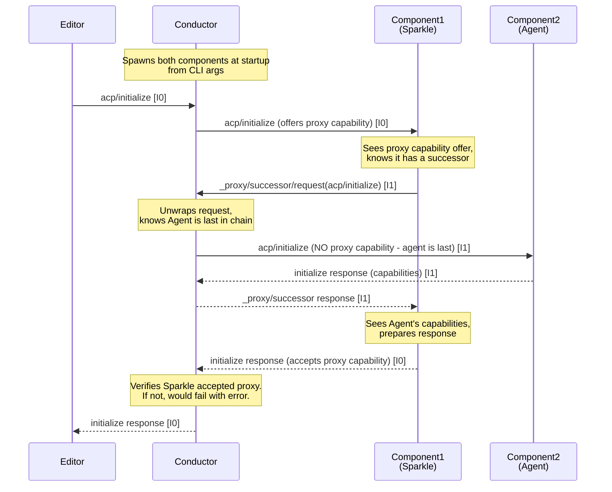

# Conductor: P/ACP Orchestrator

{{#rfd: proxying-acp}}

The **Conductor** (binary name: `conductor`) is the orchestrator for P/ACP proxy chains. It coordinates the flow of ACP messages through a chain of proxy components.

## Overview

The conductor orchestrates proxy chains by sitting **between every component**. It spawns component processes and routes all messages, presenting itself as a normal ACP agent to the editor.



**Key insight**: Components never talk directly to each other. The conductor routes ALL messages using the `_proxy/successor/*` protocol.

**From the editor's perspective**: Conductor is a normal ACP agent communicating over stdio.

**From each component's perspective**: 
- Receives normal ACP messages from the conductor
- Sends `_proxy/successor/request` to conductor to forward messages TO successor
- Receives `_proxy/successor/request` from conductor for messages FROM successor

See [Architecture Overview](./architecture.md) for detailed conceptual and actual message flows.

## Responsibilities

The conductor has four core responsibilities:

### 1. Process Management

- Spawns component processes based on command-line arguments
- Manages component lifecycle (startup, shutdown, error handling)
- For MVP: If any component crashes, shut down the entire chain

**Command-line interface:**
```bash
# Agent mode - manages proxy chain
conductor agent sparkle-acp claude-code-acp

# MCP mode - bridges stdio to TCP for MCP-over-ACP
conductor mcp 54321
```

**Agent mode** creates a chain: `Editor → Conductor → sparkle-acp → claude-code-acp`

**MCP mode** bridges MCP JSON-RPC (stdio) to raw JSON-RPC (TCP connection to main conductor)

### 2. Message Routing

The conductor routes ALL messages between components. No component talks directly to another.

**Message ordering**: The conductor preserves message send order by routing all forwarding decisions through a central event loop, preventing responses from overtaking notifications.

**Message flow types:**

1. **Editor → First Component**: Conductor forwards normal ACP messages
2. **Component → Successor**: Component sends `_proxy/successor/request` to conductor, which unwraps and forwards to next component
3. **Successor → Component**: Conductor wraps messages in `_proxy/successor/request` when sending FROM successor
4. **Responses**: Flow back via standard JSON-RPC response IDs

See [Architecture Overview](./architecture.md#message-flow) for detailed request/response flow diagrams.

### 3. Capability Management

The conductor manages proxy capability handshakes during initialization:

**Normal Mode (conductor as root):**
- Offers `proxy: true` to all components EXCEPT the last
- Verifies each proxy component accepts the capability
- Last component (agent) receives standard ACP initialization

**Proxy Mode (conductor as proxy):**
- When conductor itself receives `proxy: true` during initialization
- Offers `proxy: true` to ALL components (including the last)
- Enables tree-structured proxy chains

See [Architecture Overview](./architecture.md#capability-handshake) for detailed handshake flows and [Proxy Mode](#proxy-mode) below for hierarchical chain details.

### 4. MCP Bridge Adaptation

When components provide MCP servers with ACP transport (`"url": "acp:$UUID"`):

**If agent has `mcp_acp_transport` capability:**
- Pass through MCP server declarations unchanged
- Agent handles `_mcp/*` messages natively

**If agent lacks `mcp_acp_transport` capability:**
- Bind TCP port for each ACP-transport MCP server
- Transform MCP server spec to use `conductor mcp $port`
- Spawn `conductor mcp $port` bridge processes
- Route MCP tool calls:
  - Agent → stdio → bridge → TCP → conductor → `_mcp/*` messages backward up chain
  - Component responses flow back: component → conductor → TCP → bridge → stdio → agent

See [MCP Bridge](./mcp-bridge.md) for full implementation details.

## Proxy Mode

The conductor can itself operate as a proxy component within a larger chain, enabling **tree-structured proxy architectures**.

### How Proxy Mode Works

When the conductor receives an `initialize` request **with** the `proxy` capability:

1. **Detection**: Conductor detects it's being used as a proxy component
2. **All components become proxies**: Offers `proxy: true` to ALL managed components (including the last)
3. **Successor forwarding**: When the final component sends `_proxy/successor/request`, conductor forwards to **its own successor**

### Example: Hierarchical Chain

```
client → proxy1 → conductor (proxy mode) → final-agent
                      ↓ manages
                  p1 → p2 → p3
```

**Message flow when p3 forwards to successor:**
1. p3 sends `_proxy/successor/request` to conductor
2. Conductor recognizes it's in proxy mode
3. Conductor sends `_proxy/successor/request` to proxy1 (its predecessor)
4. proxy1 routes to final-agent

### Use Cases

**Modular sub-chains**: Group related proxies into a conductor-managed sub-chain that can be inserted anywhere

**Conditional routing**: A proxy can route to conductor-based sub-chains based on request type

**Isolated environments**: Each conductor manages its own component lifecycle while participating in larger chains

### Implementation Notes

- Proxy mode is detected during initialization by checking for `proxy: true` in incoming `initialize` request
- In normal mode: last component is agent (no proxy capability)
- In proxy mode: all components are proxies (all receive proxy capability)
- The conductor's own successor is determined by whoever initialized it

See [Architecture Overview](./architecture.md#proxy-mode) for conceptual diagrams.

## Initialization Flow



Key points:
1. **Conductor spawns ALL components at startup** based on command-line args
2. **Sequential initialization**: Conductor → Component1 → Component2 → ... → Agent
3. **Proxy capability handshake**:
   - Conductor **offers** `proxy: true` to non-last components (in InitializeRequest `_meta`)
   - Components **must accept** by responding with `proxy: true` (in InitializeResponse `_meta`)
   - Last component (agent) is NOT offered proxy capability
   - Conductor **verifies** acceptance and fails initialization if missing
4. **Components use `_proxy/successor/request`** to initialize their successors
5. **Capabilities flow back up the chain**: Each component sees successor's capabilities before responding
6. **Message IDs**: Preserved from editor (I0), new IDs for proxy messages (I1, I2, ...)

## Implementation Architecture

The conductor uses an actor-based architecture with message passing via channels.

### Core Components

- **Main connection**: Handles editor stdio and spawns the event loop
- **Component connections**: Each component has a bidirectional JSON-RPC connection
- **Message router**: Central actor that receives `ConductorMessage` enums and routes appropriately
- **MCP bridge actors**: Manage MCP-over-ACP connections

### Message Ordering Invariant

**Critical invariant**: All messages (requests, responses, notifications) between any two endpoints must maintain their send order.

The conductor ensures this invariant by routing **all** message forwarding through its central message queue (`ConductorMessage` channel). This prevents faster message types (responses) from overtaking slower ones (notifications).

#### Why This Matters

Without ordering preservation, a race condition can occur:
1. Agent sends `session/update` notification
2. Agent responds to `session/prompt` request  
3. Response takes a fast path (reply_actor with oneshot channels)
4. Notification takes slower path (handler pipeline)
5. **Response arrives before notification** → client loses notification data

#### Implementation

The conductor uses extension traits to route all forwarding through the central queue:

- `JrConnectionCxExt::send_proxied_message_via` - Routes both requests and notifications
- `JrRequestCxExt::respond_via` - Routes responses through the queue
- `JrResponseExt::forward_response_via` - Ensures response forwarding maintains order

All message forwarding in both directions (client-to-agent and agent-to-client) flows through the conductor's central event loop, which processes `ConductorMessage` enums sequentially. This serialization ensures messages arrive in the same order they were sent.

See `RACE_CONDITION_ANALYSIS.md` for detailed technical analysis of the race condition and fix.

### Message Routing Implementation

The conductor uses a recursive spawning pattern:

1. **Recursive chain building**: Each component spawns the next, establishing connections
2. **Actor-based routing**: All messages flow through a central conductor actor via channels
3. **Response routing**: Uses JSON-RPC response IDs and request contexts to route back
4. **No explicit ID tracking**: Context passing eliminates need for manual ID management

**Key routing decisions:**

- **Normal mode**: Last component gets normal ACP (no proxy capability)
- **Proxy mode**: All components get proxy capability, final component can forward to conductor's successor
- **Bidirectional `_proxy/successor/*`**: Used for both TO successor (unwrap and forward) and FROM successor (wrap and deliver)

### Concurrency Model

Built on Tokio async runtime:
- **Async I/O**: All stdio operations are non-blocking
- **Message passing**: Components communicate via mpsc channels
- **Spawned tasks**: Each connection handler runs as separate task
- **Error propagation**: Tasks send errors back to main actor via channels

See source code in `src/sacp-conductor/src/conductor.rs` for implementation details.

## Error Handling

### Component Crashes

If any component process exits or crashes:
1. Log error to stderr
2. Shut down entire Conductor process
3. Exit with non-zero status

The editor will see the ACP connection close and can handle appropriately.

### Invalid Messages

If Conductor receives malformed JSON-RPC:
- Log to stderr
- Continue processing (don't crash the chain)
- May result in downstream errors

### Initialization Failures

If component fails to initialize:
1. Log error
2. Return error response to editor
3. Shut down

## Implementation Phases

### Phase 1: Basic Routing (MVP)
- [x] Design documented
- [x] Parse command-line arguments (component list)
- [x] Spawn components recursively (alternative to "spawn all at startup")
- [x] Set up stdio pipes for all components
- [x] Message routing logic:
  - [x] Editor → Component1 forwarding
  - [x] `_proxy/successor/request` unwrapping and forwarding
  - [x] Response routing via context passing (alternative to explicit ID tracking)
  - [x] Component → Editor message routing
- [x] Actor-based message passing architecture with `ConductorMessage` enum
- [x] Error reporting from spawned tasks to conductor
- [ ] **PUNCH LIST - Remaining MVP items:**
  - [ ] Fix typo: `ComnponentToItsClientMessage` → `ComponentToItsClientMessage`
  - [ ] Proxy capability handshake during initialization:
    - [ ] Offer `proxy: true` in `_meta` to non-last components during `acp/initialize`
    - [ ] Do NOT offer `proxy` to last component (agent)
    - [ ] Verify component accepts by checking for `proxy: true` in InitializeResponse `_meta`
    - [ ] Fail initialization with error "component X is not a proxy" if handshake fails
  - [ ] Add documentation/comments explaining recursive chain building
  - [ ] Add logging (message routing, component startup, errors)
  - [ ] Write tests (proxy capability handshake, basic routing, initialization, error handling)
  - [ ] Component crash detection and chain shutdown

### Phase 2: Robust Error Handling
- [x] Basic error reporting from async tasks
- [ ] Graceful component shutdown
- [ ] Retry logic for transient failures
- [ ] Health checks
- [ ] Timeout handling for hung requests

### Phase 3: Observability
- [ ] Structured logging/tracing
- [ ] Performance metrics
- [ ] Debug mode with message inspection

### Phase 4: Advanced Features
- [ ] Dynamic component loading
- [ ] Hot reload of components
- [ ] Multiple parallel chains

## Testing Strategy

### Unit Tests
- Message parsing and forwarding logic
- Capability modification
- Error handling paths

### Integration Tests
- Full chain initialization
- Message flow through real components
- Component crash scenarios
- Malformed message handling

### End-to-End Tests
- Real editor + Conductor + test components
- Sparkle + Claude Code integration
- Performance benchmarks

## Open Questions

1. **Component discovery**: How do we find component binaries? PATH? Configuration file?
2. **Configuration**: Should Conductor support a config file for default chains?
3. **Logging**: Structured logging format? Integration with existing Symposium logging?
4. **Metrics**: Should Conductor expose metrics (message counts, latency)?
5. **Security**: Do we need to validate/sandbox component processes?

## Related Documentation

- [P/ACP RFD](../rfds/draft/proxying-acp.md) - Full protocol specification
- [Proxying ACP Server Trait](./proxying-acp-server-trait.md) - Component implementation guide
- [Sparkle Component](./sparkle-component.md) - Example P/ACP component
