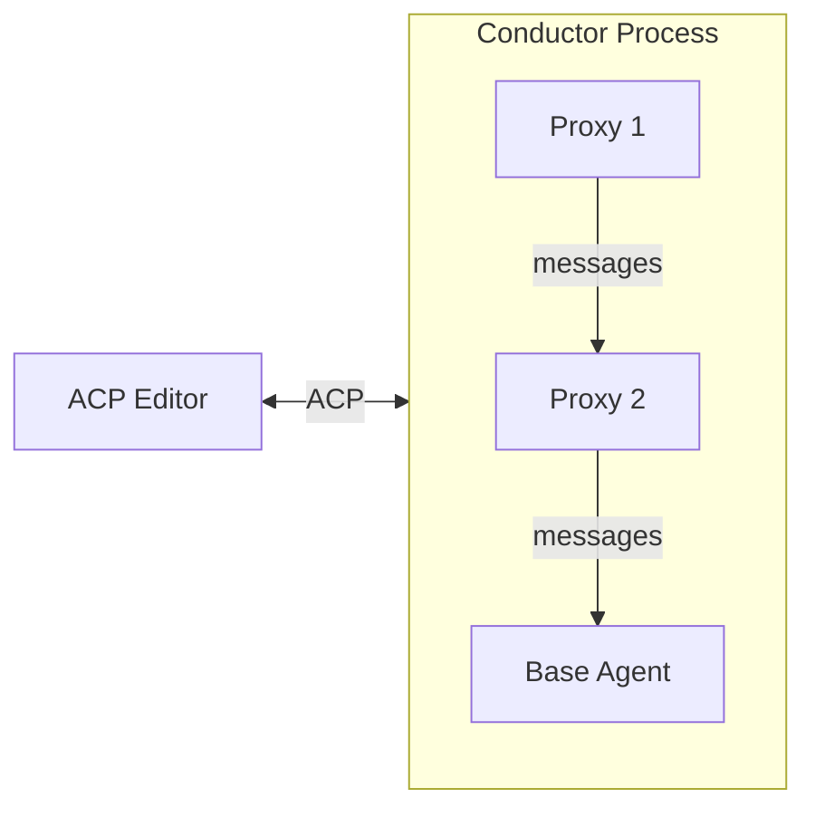

# Introduction

**SACP** (Symposium's extensions to ACP) is an SDK for building composable AI agent systems using the [Agent-Client Protocol](https://agentclientprotocol.com/).

## What is SACP?

SACP extends the Agent-Client Protocol (ACP) to enable **composable agent architectures through proxy chains**. Instead of building monolithic AI tools, SACP allows you to create modular components that can intercept and transform messages flowing between editors and agents.

Think of it like middleware for AI agents: you can add logging, inject context, provide additional tools, or modify behavior - all without changing the editor or base agent.

## Key Capabilities

- **Proxy Chains**: Chain together multiple components, each adding specific capabilities
- **Message Transformation**: Intercept and modify requests and responses
- **Tool Injection**: Add MCP servers and tools to any agent
- **Editor Agnostic**: Works with any ACP-compatible editor (Zed, Claude Code, etc.)
- **Agent Agnostic**: Works with any ACP-compatible agent

## Example Use Case: Sparkle Integration

Consider integrating Sparkle (a collaborative AI framework) into a coding session. Sparkle needs initialization and provides MCP tools.

**Without SACP**: Manual initialization each session, or agent-specific modifications.

**With SACP**: A Sparkle proxy component automatically:
1. Injects Sparkle's MCP server during initialization
2. Prepends the embodiment sequence to the first prompt
3. Passes everything else through transparently

The editor sees a normal ACP agent. The base agent has Sparkle tools available. No code changes needed on either side.

## Architecture Overview

SACP introduces three types of components:

- **Conductor**: Orchestrates the proxy chain, appears as a normal ACP agent to editors
- **Proxies**: Intercept and transform messages, built using the `sacp-proxy` framework
- **Agents**: Provide base AI model behavior using standard ACP

The conductor manages message routing, making the proxy chain transparent to editors.

## Who Should Use SACP?

- **Proxy Developers**: Build reusable components that add capabilities to any agent
- **Agent Developers**: Create specialized agents that work with any ACP editor
- **Client Developers**: Build ACP-compatible editors and tools
- **Integration Developers**: Connect AI agents with existing systems and workflows

## Repository Structure

This repository provides three core crates:

- **`sacp`**: Core protocol types and traits for building clients and agents
- **`sacp-proxy`**: Framework for building proxy components
- **`sacp-conductor`**: Binary that orchestrates proxy chains

## Getting Started

- Read the [Architecture Overview](./architecture.md) to understand how SACP works
- See the [Protocol Reference](./protocol.md) for technical details
- Follow [Building a Proxy](./building-proxy.md) to create your first component
- Check out the [SACP RFD](./proxying-acp.md) for the complete specification

## Relationship to ACP

SACP is an [extension to ACP](https://agentclientprotocol.com/protocol/extensibility), not a fork. SACP components communicate using ACP's extension protocol (`_meta` fields and custom methods). Standard ACP editors and agents work with SACP without modification - they simply see a normal ACP agent when talking to the conductor.
