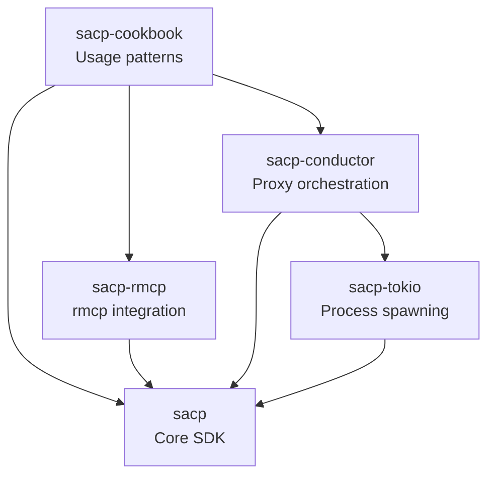

# Symposium ACP

This repository contains Symposium's implementation of the [Agent-Client Protocol (ACP)](https://agentclientprotocol.com/).

## For Users

**If you want to build something with these crates**, see the rustdoc:

- **[`sacp`](https://docs.rs/sacp)** - Core SDK for building clients, agents, and proxies
- **[`sacp-cookbook`](https://docs.rs/sacp-cookbook)** - Practical patterns and examples
- **[`sacp-conductor`](https://docs.rs/sacp-conductor)** - Running proxy chains

The `sacp` crate includes a [`concepts`](https://docs.rs/sacp/latest/sacp/concepts/) module that explains how connections, sessions, callbacks, and message ordering work.

## For Maintainers and Agents

**This book** documents the design and architecture for people working on the codebase itself.

### Repository Structure

```
src/
├── sacp/              # Core protocol SDK
├── sacp-tokio/        # Tokio utilities (process spawning)
├── sacp-rmcp/         # Integration with rmcp crate
├── sacp-cookbook/     # Usage patterns (rendered as rustdoc)
├── sacp-derive/       # Proc macros
├── sacp-conductor/    # Conductor binary and library
├── sacp-test/         # Test utilities and fixtures
├── sacp-trace-viewer/ # Trace visualization tool
├── elizacp/           # Example agent implementation
└── yopo/              # "You Only Prompt Once" example client
```

### Crate Relationships



### Key Design Documents

- [Core Library Design](./sacp-design.md) - How `sacp`, `sacp-tokio`, and `sacp-rmcp` are organized
- [Conductor Design](./conductor.md) - How the conductor orchestrates proxy chains
- [Protocol Reference](./protocol.md) - Wire protocol details and extension methods
- [P/ACP Specification](./proxying-acp.md) - The full proxy protocol specification
