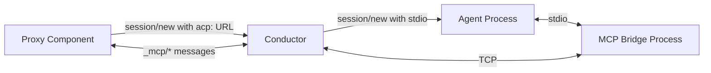
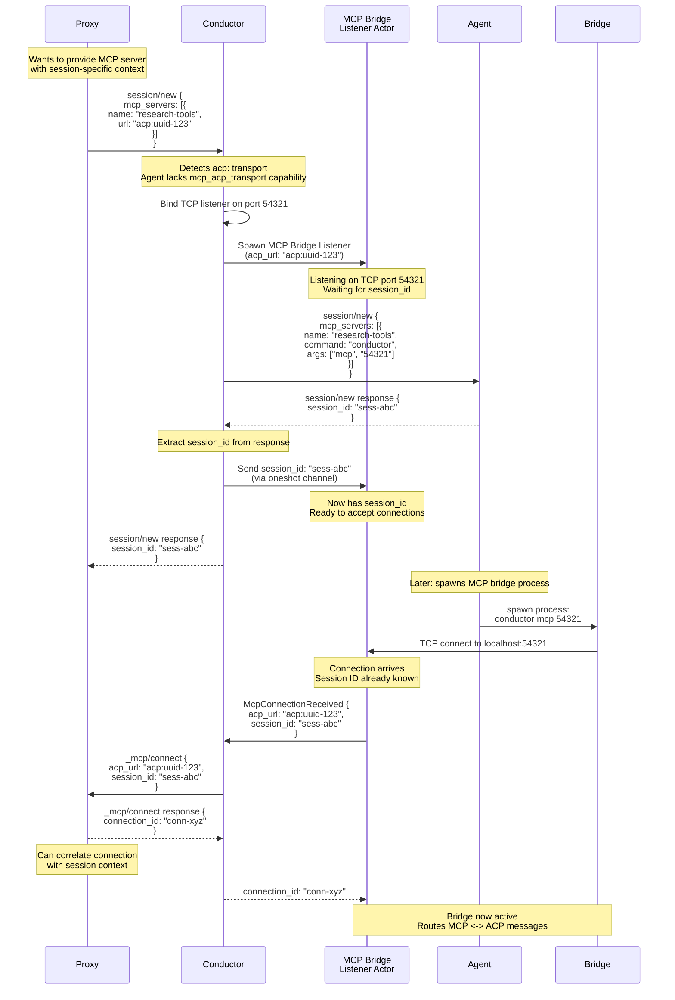
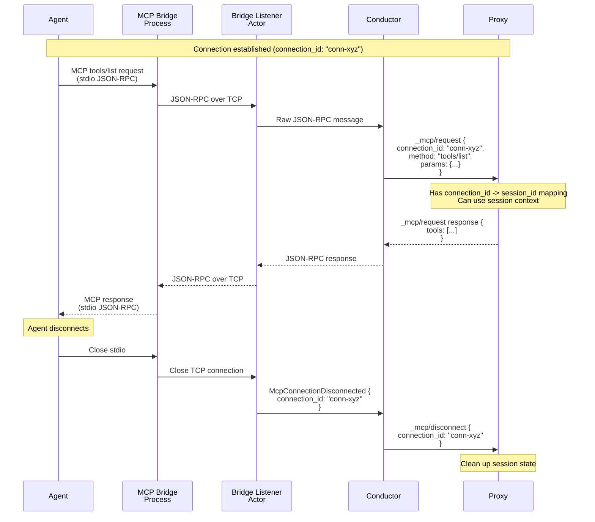
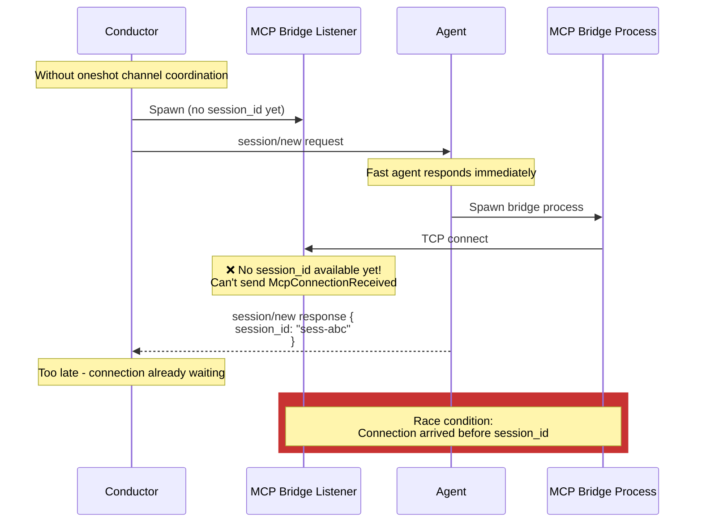
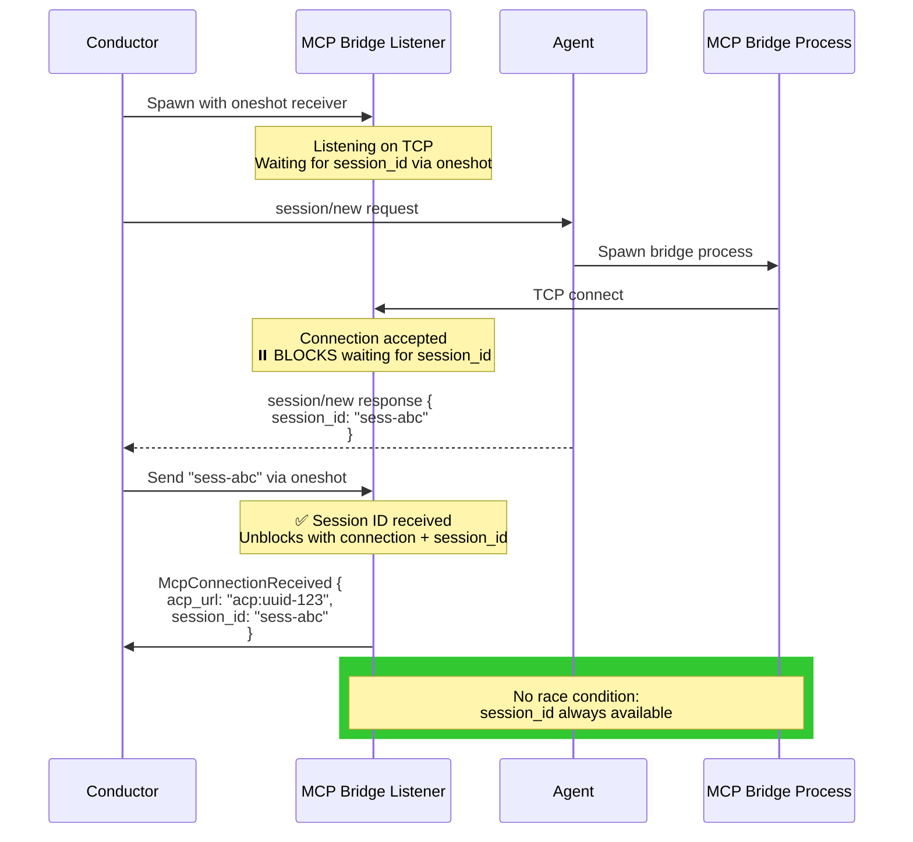
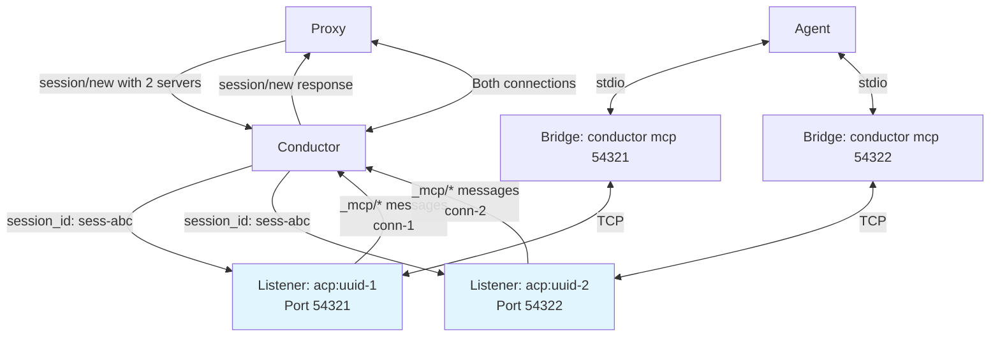

# MCP Bridge: Proxying MCP over ACP

The **MCP Bridge** enables agents without native MCP-over-ACP support to work with proxy components that provide MCP servers using ACP transport (`acp:$UUID`).

## Problem Statement

Proxy components may want to expose MCP servers to agents using ACP as the transport layer. This allows:
- Dynamic MCP server registration during session creation
- Proxies to correlate MCP tool calls with specific ACP sessions
- Unified protocol handling (everything flows through ACP messages)

However, many agents only support traditional MCP transports (stdio, SSE). The conductor bridges this gap by:
1. Accepting `acp:$UUID` URLs in `session/new` requests
2. Transforming them into stdio-based MCP servers the agent can connect to
3. Routing MCP messages between the agent (stdio) and proxies (ACP `_mcp/*` messages)

## High-Level Architecture

**Key decision**: Use stdio + TCP bridge instead of direct stdio to agent, because:
- Preserves agent isolation (agent only sees stdio)
- Enables connection multiplexing (multiple bridges to one conductor)
- Simplifies lifecycle management (bridge exits when agent closes stdio)

## Session Initialization Flow

The conductor transforms MCP servers during session creation and correlates them with session IDs.

### Key Decisions

**Why spawn TCP listener before getting session_id (during request, not response)?**
- Agent may spawn bridge process immediately after receiving `session/new` response
- If listener doesn't exist yet, bridge connection fails with "connection refused"
- Spawning during request ensures TCP port is ready before agent receives response
- Session_id delivered asynchronously via oneshot channel once response arrives

**Why send session_id to listener before forwarding response?**
- Ensures session_id is available before agent spawns bridge process
- Eliminates race condition where TCP connection arrives before session_id known
- Listener blocks on receiving session_id, guaranteeing it's available when needed

**Why include session_id in `_mcp/connect`?**
- Proxies need to correlate MCP connections with ACP sessions
- Example: Research proxy remembers session context (current task, preferences)
- Without session_id, proxy has no way to associate connection with session state

**Why use oneshot channel for session_id delivery?**
- Listener spawned during request handling (before response available)
- Response comes asynchronously from agent
- Oneshot channel delivers session_id exactly once when response arrives
- Clean separation: listener setup (during request) vs session_id delivery (during response)

## Connection Lifecycle

Once the MCP connection is established, the bridge routes messages bidirectionally:

### Key Decisions

**Why route through conductor instead of direct bridge-to-proxy?**
- Maintains consistent message ordering through central conductor queue
- Preserves conductor's role as sole message router
- Simplifies error handling and lifecycle management

**Why use connection_id instead of session_id in `_mcp/*` messages?**
- One session can have multiple MCP connections (multiple servers)
- Connection_id uniquely identifies the bridge instance
- Proxies maintain `connection_id -> session_id` mapping internally

**Why send disconnect notification?**
- Allows proxies to clean up session-specific state
- Enables resource cleanup (close files, release locks, etc.)
- Provides explicit lifecycle boundary

## Race Condition Handling

The session_id delivery mechanism prevents a race condition:

**Solution**: Listener blocks on oneshot channel:

**Key decision**: Block connection acceptance on session_id availability
- Listener accepts TCP connection immediately (agent won't wait)
- But blocks sending `McpConnectionReceived` until session_id arrives
- Guarantees session_id is always available when creating `_mcp/connect` request
- Simple implementation: `oneshot_rx.await?` before sending message

## Multiple MCP Servers

A single session can register multiple MCP servers:

**Key decisions**:
- Each `acp:` URL gets its own TCP port and listener
- All listeners for a session receive the same session_id
- Each connection gets unique connection_id
- Proxy maintains map: `connection_id -> (session_id, acp_url)`

## Implementation Components

### McpBridgeListeners
- **Purpose**: Manages TCP listeners for all `acp:` URLs
- **Lifecycle**: Created with conductor, lives for entire conductor lifetime
- **Responsibilities**:
  - Detect `acp:` URLs during `session/new`
  - Spawn TCP listeners on ephemeral ports
  - Transform MCP server specs to stdio transport
  - Deliver session_id to listeners via oneshot channels

### McpBridgeListener Actor
- **Purpose**: Accepts TCP connections for a specific `acp:` URL
- **Lifecycle**: Spawned during `session/new`, lives until conductor exits
- **Responsibilities**:
  - Listen on TCP port
  - Block on oneshot channel to receive session_id
  - Accept connections and send `McpConnectionReceived` with session_id
  - Spawn connection actors

### McpBridgeConnectionActor
- **Purpose**: Routes messages for a single MCP connection
- **Lifecycle**: Spawned when agent connects, exits when agent disconnects
- **Responsibilities**:
  - Read JSON-RPC from TCP, forward to conductor
  - Receive messages from conductor, write to TCP
  - Send `McpConnectionDisconnected` on close

### MCP Bridge Process (`conductor mcp $PORT`)
- **Purpose**: Bridges agent's stdio to conductor's TCP
- **Lifecycle**: Spawned by agent, exits when stdio closes
- **Responsibilities**:
  - Connect to TCP port on startup
  - Bidirectional stdio ↔ TCP forwarding
  - No protocol awareness (just bytes)

## Error Handling

### Agent Disconnects During Session Creation

If agent closes connection before sending `session/new` response:
- Oneshot channel sender drops
- Listener receives `Err` from oneshot
- Listener exits gracefully
- TCP port cleaned up

### Bridge Process Crashes

If bridge process exits unexpectedly:
- TCP connection closes
- Listener detects disconnect
- Sends `McpConnectionDisconnected`
- Proxy cleans up state

### Multiple Connections to Same Listener

Decision: Allow multiple connections per listener (for future flexibility)
- Each connection gets unique connection_id
- All connections share same session_id
- Proxy can correlate all connections to session

## Related Documentation

- [Conductor Implementation](./conductor.md) - Conductor architecture
- [Protocol Reference](./protocol.md) - ACP message formats
- [Building a Proxy](./building-proxy.md) - Implementing MCP-aware proxies
