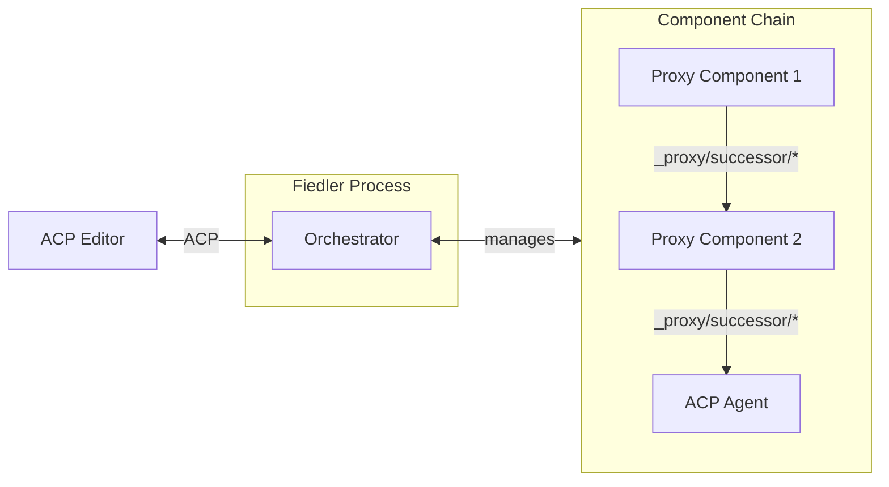

# P/ACP Components

{{#rfd: proxying-acp}}

This section documents the components that implement the P/ACP (Proxying ACP) protocol for composable agent architectures.

## Overview

P/ACP enables building modular agent systems by chaining components together. Each component can intercept and transform ACP messages flowing between editors and agents.

The key components are:

- **[Fiedler: ACP Conductor](./fiedler-conductor.md)** - The orchestrator that manages the proxy chain and presents as a normal ACP agent to editors
- **ProxyingAcpServer Trait** (planned) - The trait/interface that makes writing proxy components easy
- **Sparkle Component** (planned) - Example component that injects Sparkle collaborative patterns

## Architecture

**Key principles:**

1. **Editor transparency**: Editors see Fiedler as a normal ACP agent—no special protocol awareness needed
2. **Component composition**: Proxies can be mixed and matched without knowing about each other
3. **Capability negotiation**: Each component controls what capabilities it advertises to its predecessor
4. **Simple forwarding**: Default behavior is to forward messages unchanged; components only override what they need

## Component Lifecycle

1. **Initialization**: Editor sends `acp/initialize` to Fiedler
2. **Chain setup**: Fiedler spawns first component, which initializes its successor, etc.
3. **Capability negotiation**: Capabilities flow back up the chain, each component adding its own
4. **Message routing**: Messages flow down the chain, responses flow back up
5. **Shutdown**: If any component exits, the entire chain shuts down

## Related Documentation

- [P/ACP RFD](../rfds/draft/proxying-acp.md) - Full protocol specification and motivation
