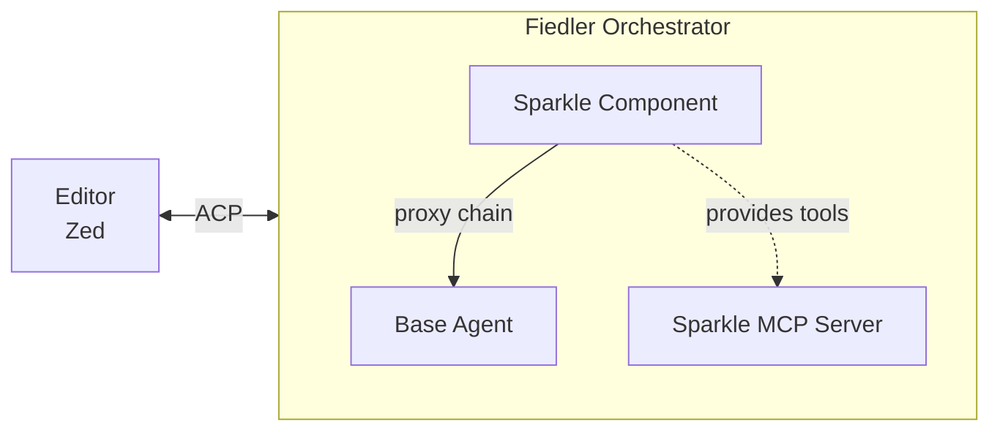
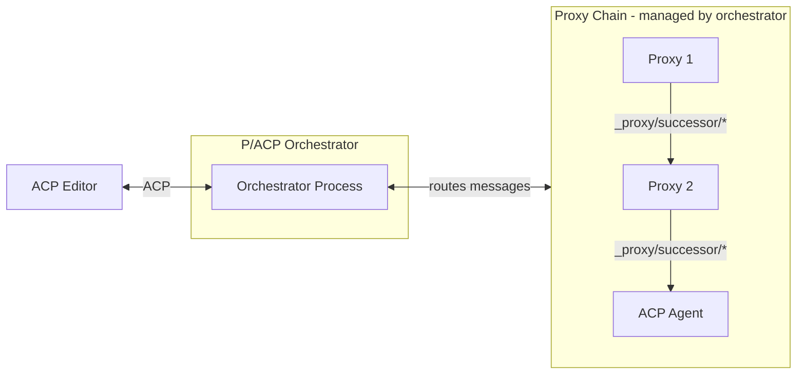
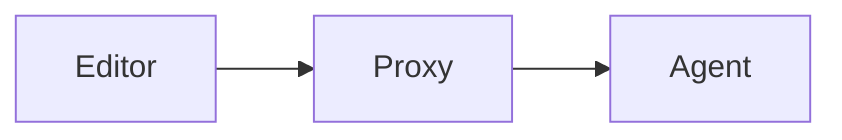
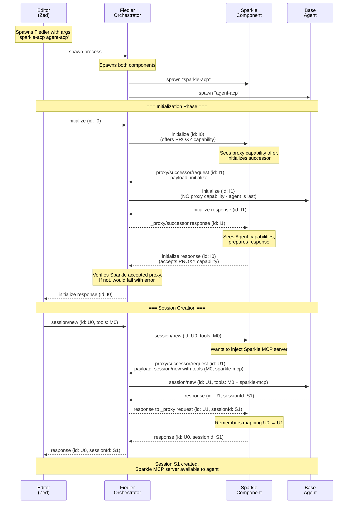
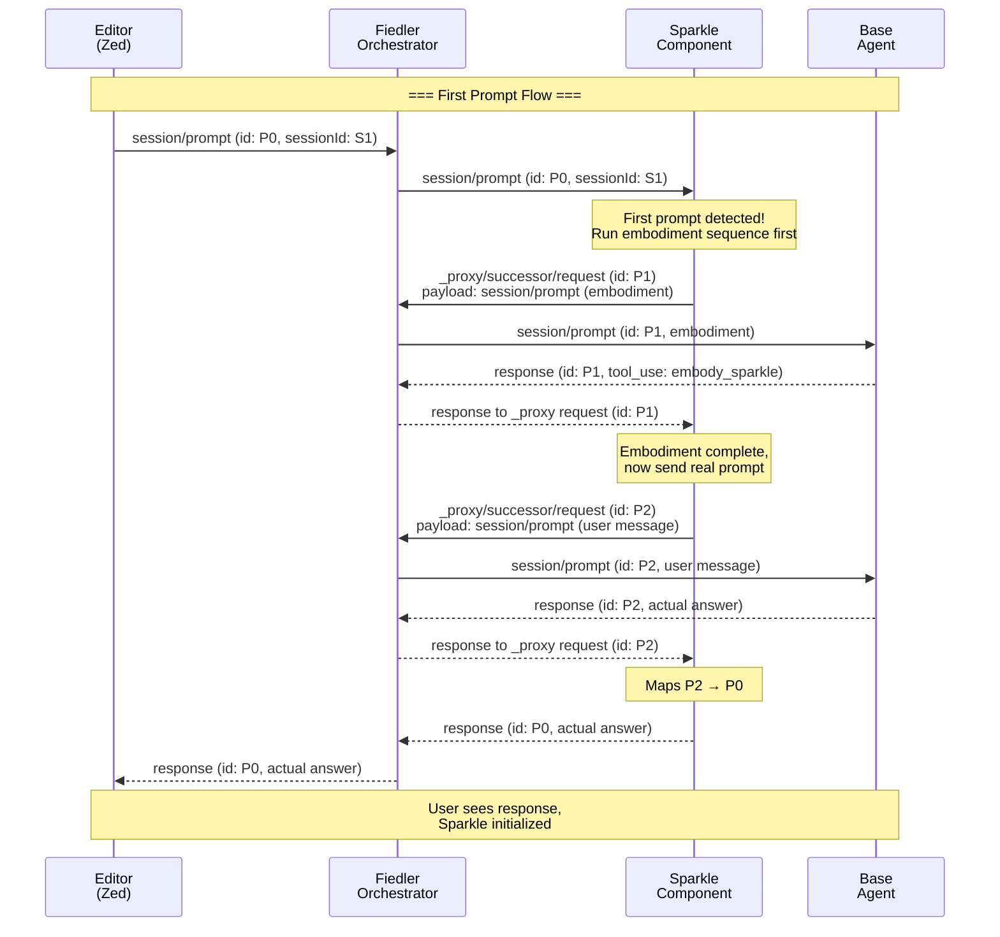
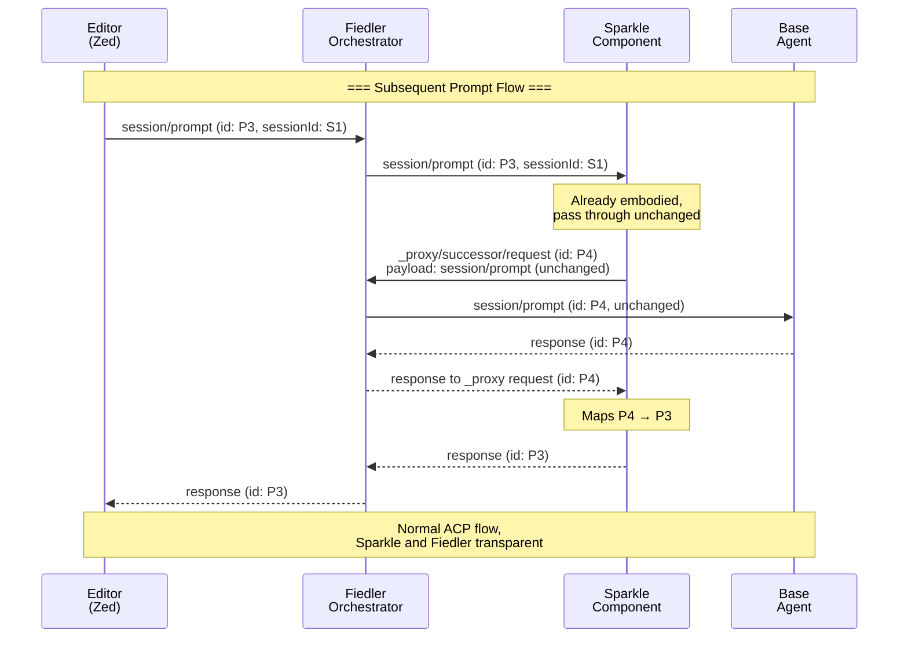

# Composable Agents via P/ACP (Proxying ACP)

# Elevator pitch

> What are you proposing to change?

We propose to prototype **P/ACP** (Proxying ACP), an extension to Zed's Agent Client Protocol (ACP) that enables composable agent architectures through proxy chains. Instead of building monolithic AI tools, P/ACP allows developers to create modular components that can intercept and transform messages flowing between editors and agents.

This RFD builds on the concepts introduced in [SymmACP: extending Zed's ACP to support Composable Agents](https://smallcultfollowing.com/babysteps/blog/2025/10/08/symmacp), with the protocol renamed to P/ACP for this implementation.

Key changes:
* Define a proxy chain architecture where components can transform ACP messages
* Create an orchestrator (Fiedler) that manages the proxy chain and presents as a normal ACP agent to editors
* Establish the `_proxy/successor/*` protocol for proxies to communicate with downstream components
* Enable composition without requiring editors to understand P/ACP internals

# Status quo

> How do things work today and what problems does this cause? Why would we change things?

Today's AI agent ecosystem is dominated by monolithic agents. We want people to be able to combine independent components to build custom agents targeting their specific needs. We want them to be able to use these with whatever editors and tooling they have. This is aligned with Symposium's core values of openness, interoperability, and extensibility.

# Motivating Example: Sparkle Integration

Consider integrating Sparkle (a collaborative AI framework) into a coding session with Zed and Claude. Sparkle provides an MCP server with tools, but requires an initialization sequence to load patterns and set up collaborative context.

**Without P/ACP:**
- Users must manually run the initialization sequence each session
- Or use agent-specific hooks (Claude Code has them, but not standardized across agents)
- Or modify the agent to handle initialization automatically
- Result: Manual intervention required, agent-specific configuration, no generic solution

**With P/ACP:**



The Sparkle component:
1. Injects Sparkle MCP server into the agent's tool list during `initialize`
2. Intercepts the first `prompt` and prepends Sparkle embodiment sequence
3. Passes all other messages through transparently

From the editor's perspective, it talks to a normal ACP agent. From the base agent's perspective, it has Sparkle tools available. No code changes required on either side.

This demonstrates P/ACP's core value: adding capabilities through composition rather than modification.

# What we propose to do about it

> What are you proposing to improve the situation?

We will develop an [extension to ACP](https://agentclientprotocol.com/protocol/extensibility) called **P/ACP** (Proxying ACP).

The heart of P/ACP is a proxy chain where each component adds specific capabilities:



P/ACP defines three kinds of actors:

* **Editors** spawn the orchestrator and communicate via standard ACP
* **Orchestrator** manages the proxy chain, appears as a normal ACP agent to editors
* **Proxies** intercept and transform messages, communicate with downstream via `_proxy/successor/*` protocol
* **Agents** provide base AI model behavior using standard ACP

The orchestrator handles message routing, making the proxy chain transparent to editors. Proxies can transform requests, responses, or add side-effects without editors or agents needing P/ACP awareness.

## The Orchestrator: Conductor

P/ACP's orchestrator is called the **Conductor** (binary name: `conductor`, inspired by Arthur Fiedler, conductor of the Boston Pops). The conductor has three core responsibilities:

1. **Process Management** - Creates and manages component processes based on command-line configuration
2. **Message Routing** - Routes messages between editor, components, and agent through the proxy chain
3. **Capability Adaptation** - Observes component capabilities and adapts between them

**Key adaptation: MCP Bridge**
- If the agent supports `mcp_acp_transport`, conductor passes MCP servers with ACP transport through unchanged
- If not, conductor spawns `conductor mcp $port` processes to bridge between stdio (MCP) and ACP messages
- Components can provide MCP servers without requiring agent modifications
- See "MCP Bridge" section in Implementation Details for full protocol

**Other adaptations** include session pre-population, streaming support, content types, and tool formats.

**From the editor's perspective**, it spawns one conductor process and communicates using normal ACP over stdio. The editor doesn't know about the proxy chain.

**Command-line usage:**
```bash
# Agent mode - manages proxy chain
conductor agent sparkle-acp claude-code-acp

# MCP mode - bridges stdio to TCP for MCP-over-ACP
conductor mcp 54321
```

To editors, the conductor is a normal ACP agent - no special capabilities are advertised upstream.

**Proxy Capability Handshake:**

The conductor uses a two-way capability handshake to verify that proxy components can fulfill their role:

1. **Conductor offers proxy capability** - When initializing non-last components (proxies), the conductor includes `"proxy": true` in the `_meta` field of the InitializeRequest
2. **Component accepts proxy capability** - The component must respond with `"proxy": true` in the `_meta` field of its InitializeResponse  
3. **Last component (agent)** - The final component is treated as a standard ACP agent and does NOT receive the proxy capability offer

**Why a two-way handshake?** The proxy capability is an *active protocol* - it requires the component to handle `_proxy/successor/*` messages and route communications appropriately. Unlike passive capabilities (like "http" or "sse") which are just declarations, proxy components must actively participate in message routing. If a component doesn't respond with the proxy capability, the conductor fails initialization with an error like "component X is not a proxy", since that component cannot fulfill its required role in the chain.


# Shiny future

> How will things will play out once this feature exists?

## Composable Agent Ecosystems

P/ACP enables a marketplace of reusable proxy components. Developers can:
* Compose custom agent pipelines from independently-developed proxies
* Share proxies across different editors and agents
* Test and debug proxies in isolation
* Mix community-developed and custom proxies

## Simplified Agent Development

Agent developers can focus on core model behavior without implementing cross-cutting concerns:
* Logging, metrics, and observability become proxy responsibilities
* Rate limiting and caching handled externally
* Content filtering and safety policies applied consistently

## Editor Simplicity

Editors gain enhanced functionality without custom integrations:
* Add sophisticated agent behaviors by changing proxy chain configuration
* Support new agent features without editor updates
* Maintain compatibility with any ACP agent

## Standardization Path

As the ecosystem matures, successful patterns may be:
* Standardized in ACP specification itself
* Adopted by other agent protocols
* Used as reference implementations for proxy architectures

## Implemented Extensions

**MCP Bridge** - ✅ Implemented via the `_mcp/*` protocol (see "Implementation details and plan" section). Components can provide MCP servers using ACP transport, enabling tool provision without agents needing P/ACP awareness. The conductor bridges between agents lacking native support and components.

## Future Protocol Extensions

Extensions under consideration for future development:

**Agent-Initiated Messages** - Allow components to send messages after the agent has sent end-turn, outside the normal request-response cycle. Use cases include background task completion notifications, time-based reminders, or autonomous checkpoint creation.

**Session Pre-Population** - Create sessions with existing conversation history. Conductor adapts based on agent capabilities: uses native support if available, otherwise synthesizes a dummy prompt containing the history, intercepts the response, and starts the real session.

**Rich Content Types** - Extend content types beyond text to include HTML panels, interactive GUI components, or other structured formats. Components can transform between content types based on what downstream agents support.

# Implementation details and plan

> Tell me more about your implementation. What is your detailed implementaton plan?

The implementation focuses on building Fiedler and demonstrating the Sparkle integration use case.

## P/ACP protocol

### Definition: Editor vs Agent of a proxy

For an P/ACP proxy, the "editor" is defined as the upstream connection and the "agent" is the downstream connection.



### P/ACP editor capabilities

An P/ACP-aware editor provides the following capability during ACP initialization:

```json
/// Including the symposium section *at all* means that the editor
/// supports symposium proxy initialization.
"_meta": {
    "symposium": {
        "version": "1.0",
        "html_panel": true,      // or false, if this is the ToEditor proxy
        "file_comment": true,    // or false, if this is the ToEditor proxy
    }
}
```

P/ACP proxies forward the capabilities they receive from their editor.

### P/ACP component capabilities

P/ACP uses capabilities in the `_meta` field for the proxy handshake:

**Proxy capability (two-way handshake):**

The conductor offers the proxy capability to non-last components in InitializeRequest:
```json
// InitializeRequest from conductor to proxy component
"_meta": {
    "symposium": {
        "version": "1.0",
        "proxy": true
    }
}
```

The component must accept by responding with the proxy capability in InitializeResponse:
```json
// InitializeResponse from proxy component to conductor
"_meta": {
    "symposium": {
        "version": "1.0",
        "proxy": true
    }
}
```

If a component that was offered the proxy capability does not respond with it, the conductor fails initialization.

**Agent capability:**
The last component in the chain (the agent) is NOT offered the proxy capability and does not need to respond with it. Agents are just normal ACP agents with no P/ACP awareness required.

### The `_proxy/successor/{send,receive}` protocol

Proxies communicate with their downstream component (next proxy or agent) through special extension messages handled by the orchestrator:

**`_proxy/successor/send/request`** - Proxy wants to send a request downstream:
```json
{
  "method": "_proxy/successor/send/request",
  "params": {
    "message": <ACP_REQUEST>
  }
}
```

**`_proxy/successor/send/notification`** - Proxy wants to send a notification downstream:
```json
{
  "method": "_proxy/successor/send/notification",
  "params": {
    "message": <ACP_NOTIFICATION>
  }
}
```

**`_proxy/successor/receive/request`** - Orchestrator delivers a request from downstream:
```json
{
  "method": "_proxy/successor/receive/request",
  "params": {
    "message": <ACP_REQUEST>
  }
}
```

**`_proxy/successor/receive/notification`** - Orchestrator delivers a notification from downstream:
```json
{
  "method": "_proxy/successor/receive/notification",
  "params": {
    "message": <ACP_NOTIFICATION>
  }
}
```

**Message flow example:**
1. Editor sends ACP `prompt` request to orchestrator
2. Orchestrator forwards to Proxy1 as normal ACP message
3. Proxy1 transforms and sends `_proxy/successor/send/request { message: <modified_prompt> }`
4. Orchestrator routes that to Proxy2 as normal ACP `prompt`
5. Eventually reaches agent, response flows back through chain
6. Orchestrator wraps responses going upstream appropriately

**Transparent proxy pattern:**
A pass-through proxy is trivial - just forward everything:
```rust
match message {
    // Forward requests from editor to successor
    AcpRequest(req) => send_to_successor_request(req),

    // Forward notifications from editor to successor
    AcpNotification(notif) => send_to_successor_notification(notif),

    // Forward from successor back to editor
    ExtRequest("_proxy/successor/receive/request", msg) => respond_to_editor(msg),
    ExtNotification("_proxy/successor/receive/notification", msg) => forward_to_editor(msg),
}
```

### The MCP Bridge: `_mcp/*` Protocol

P/ACP enables components to provide MCP servers that communicate over ACP messages rather than traditional stdio. This allows components to handle MCP tool calls without agents needing special P/ACP awareness.

#### MCP Server Declaration with ACP Transport

Components declare MCP servers with ACP transport by using the HTTP MCP server format with a special URL scheme:

```json
{
  "tools": {
    "mcpServers": {
      "sparkle": {
        "transport": "http",
        "url": "acp:550e8400-e29b-41d4-a716-446655440000",
        "headers": {}
      }
    }
  }
}
```

The `acp:$UUID` URL signals ACP transport. The component generates the UUID to identify which component handles calls to this MCP server.

#### Agent Capability: `mcp_acp_transport`

Agents that natively support MCP-over-ACP declare this capability:

```json
{
  "_meta": {
    "mcp_acp_transport": true
  }
}
```

**Conductor behavior:**
- If the final agent has `mcp_acp_transport: true`, conductor passes MCP server declarations through unchanged
- If the final agent lacks this capability, conductor performs **bridging adaptation**:
  1. Binds a fresh TCP port (e.g., `localhost:54321`)
  2. Transforms the MCP server declaration to use `conductor mcp $port` as the command
  3. Spawns `conductor mcp $port` which connects back via TCP and bridges to ACP messages
  4. Always advertises `mcp_acp_transport: true` to intermediate components

#### Bridging Transformation Example

**Original MCP server spec (from component):**
```json
{
  "sparkle": {
    "transport": "http",
    "url": "acp:550e8400-e29b-41d4-a716-446655440000",
    "headers": {}
  }
}
```

**Transformed spec (passed to agent without `mcp_acp_transport`):**
```json
{
  "sparkle": {
    "command": "conductor",
    "args": ["mcp", "54321"],
    "transport": "stdio"
  }
}
```

The agent thinks it's talking to a normal MCP server over stdio. The `conductor mcp` process bridges between stdio (MCP JSON-RPC) and TCP (connection to main conductor), which then translates to ACP `_mcp/*` messages.

#### MCP Message Flow Protocol

When MCP tool calls occur, they flow as ACP extension messages:

**`_mcp/client_to_server/request`** - Agent calling an MCP tool (flows backward up chain):
```json
{
  "jsonrpc": "2.0",
  "id": "T1",
  "method": "_mcp/client_to_server/request",
  "params": {
    "url": "acp:550e8400-e29b-41d4-a716-446655440000",
    "message": {
      "jsonrpc": "2.0",
      "id": "mcp-123",
      "method": "tools/call",
      "params": {
        "name": "embody_sparkle",
        "arguments": {}
      }
    }
  }
}
```

**Response:**
```json
{
  "jsonrpc": "2.0",
  "id": "T1",
  "result": {
    "message": {
      "jsonrpc": "2.0",
      "id": "mcp-123",
      "result": {
        "content": [
          {"type": "text", "text": "Embodiment complete"}
        ]
      }
    }
  }
}
```

**`_mcp/client_to_server/notification`** - Agent sending notification to MCP server:
```json
{
  "jsonrpc": "2.0",
  "method": "_mcp/client_to_server/notification",
  "params": {
    "url": "acp:550e8400-e29b-41d4-a716-446655440000",
    "message": {
      "jsonrpc": "2.0",
      "method": "notifications/cancelled",
      "params": {}
    }
  }
}
```

**`_mcp/server_to_client/request`** - MCP server calling back to agent (flows forward down chain):
```json
{
  "jsonrpc": "2.0",
  "id": "S1",
  "method": "_mcp/server_to_client/request",
  "params": {
    "url": "acp:550e8400-e29b-41d4-a716-446655440000",
    "message": {
      "jsonrpc": "2.0",
      "id": "mcp-456",
      "method": "sampling/createMessage",
      "params": {
        "messages": [...],
        "modelPreferences": {...}
      }
    }
  }
}
```

**`_mcp/server_to_client/notification`** - MCP server sending notification to agent:
```json
{
  "jsonrpc": "2.0",
  "method": "_mcp/server_to_client/notification",
  "params": {
    "url": "acp:550e8400-e29b-41d4-a716-446655440000",
    "message": {
      "jsonrpc": "2.0",
      "method": "notifications/progress",
      "params": {
        "progressToken": "token-1",
        "progress": 50,
        "total": 100
      }
    }
  }
}
```

#### Message Routing

**Client→Server messages** (agent calling MCP tools):
- Flow **backward** up the proxy chain (agent → conductor → components)
- Component matches on `params.url` to identify which MCP server
- Component extracts `params.message`, handles the MCP call, responds

**Server→Client messages** (MCP server callbacks):
- Flow **forward** down the proxy chain (component → conductor → agent)
- Component initiates when its MCP server needs to call back (sampling, logging, progress)
- Conductor routes to agent (or via bridge if needed)

#### Conductor MCP Mode

The conductor binary has two modes:

1. **Agent mode**: `conductor agent [proxies...] agent`
   - Manages P/ACP proxy chain
   - Routes ACP messages

2. **MCP mode**: `conductor mcp $port`
   - Acts as MCP server over stdio
   - Connects to `localhost:$port` via TCP
   - Bridges MCP JSON-RPC (stdio) ↔ raw JSON-RPC (TCP to main conductor)

When bridging is needed, the main conductor spawns `conductor mcp $port` as the child process that the agent communicates with via stdio.

### Additional Extension Messages

Proxies can define their own extension messages beyond `_proxy/successor/*` to provide specific capabilities. Examples might include:

* **Logging/observability**: `_proxy/log` messages for structured logging
* **Metrics**: `_proxy/metric` messages for tracking usage
* **Configuration**: `_proxy/config` messages for dynamic reconfiguration

The orchestrator can handle routing these messages appropriately, or they can be handled by specific proxies in the chain.

These extensions are beyond the scope of this initial RFD and will be defined as needed by specific proxy implementations.

# Implementation progress

> What is the current status of implementation and what are the next steps?

## Current Status: Implementation Phase

**Completed:**
- ✅ P/ACP protocol design with Fiedler orchestrator architecture
- ✅ `_proxy/successor/{send,receive}` message protocol defined
- ✅ `scp` Rust crate with JSON-RPC layer and ACP message types
- ✅ Comprehensive JSON-RPC test suite (21 tests)
- ✅ Proxy message type definitions (`ToSuccessorRequest`, etc.)

**In Progress:**
- Fiedler orchestrator implementation
- Sparkle P/ACP component
- MCP Bridge implementation (see checklist below)

### MCP Bridge Implementation Checklist

**Phase 1: Conductor MCP Mode (COMPLETE ✅)**
- [x] Implement `conductor mcp $port` CLI parsing
- [x] TCP connection to `localhost:$port`
- [x] Stdio → TCP bridging (read from stdin, send via TCP)
- [x] TCP → Stdio bridging (read from TCP, write to stdout)
- [x] Newline-delimited JSON framing
- [x] Error handling (connection failures, parse errors, reconnection logic)
- [x] Unit tests for message bridging
- [x] Integration test: standalone MCP bridge with mock MCP client/server

**Phase 2: Conductor Agent Mode - MCP Detection & Bridging**
- [ ] Detect `"transport": "http", "url": "acp:$UUID"` MCP servers in initialization
- [ ] Check final agent for `mcp_acp_transport` capability
- [ ] Bind ephemeral TCP ports when bridging needed
- [ ] Transform MCP server specs to use `conductor mcp $port`
- [ ] Spawn `conductor mcp $port` subprocess per ACP-transport MCP server
- [ ] Store mapping: `UUID → TCP port → bridge process`
- [ ] Always advertise `mcp_acp_transport: true` to intermediate components
- [ ] Integration test: full chain with MCP bridging

**Phase 3: `_mcp/*` Message Routing**
- [ ] Route `_mcp/client_to_server/request` (TCP → ACP, backward up chain)
- [ ] Route `_mcp/client_to_server/notification` (TCP → ACP, backward)
- [ ] Route `_mcp/server_to_client/request` (ACP → TCP, forward down chain)
- [ ] Route `_mcp/server_to_client/notification` (ACP → TCP, forward)
- [ ] URL matching for component routing (`params.url` matches UUID)
- [ ] Response routing back through bridge
- [ ] Integration test: full `_mcp/*` message flow

**Phase 4: Bridge Lifecycle Management**
- [ ] Clean up bridge processes on session end
- [ ] Handle bridge process crashes
- [ ] Handle component crashes (clean up associated bridges)
- [ ] TCP connection cleanup on errors
- [ ] Port cleanup and reuse

**Phase 5: Component-Side MCP Integration**
- [ ] Sparkle component declares ACP-transport MCP server
- [ ] Sparkle handles `_mcp/client_to_server/*` messages
- [ ] Sparkle initiates `_mcp/server_to_client/*` callbacks
- [ ] End-to-end test: Sparkle embodiment via MCP bridge

## Phase 1: Minimal Sparkle Demo

**Goal:** Demonstrate Sparkle integration through P/ACP composition.

**Components:**
1. **Fiedler orchestrator** - Process management, message routing, capability adaptation
2. **Sparkle P/ACP component** - Injects Sparkle MCP server, handles embodiment sequence
3. **Integration test** - Validates end-to-end flow with mock editor/agent

**Demo flow:**
```
Zed → Fiedler → Sparkle Component → Claude
               ↓
          Sparkle MCP Server
```

**Success criteria:**
- Sparkle MCP server appears in agent's tool list
- First prompt triggers Sparkle embodiment sequence
- Subsequent prompts work normally
- All other ACP messages pass through unchanged

### Detailed MVP Walkthrough

This section shows the exact message flows for the minimal Sparkle demo.

**Understanding UUIDs in the flow:**

There are two distinct types of UUIDs in these sequences:

1. **Message IDs (JSON-RPC request IDs)**: These identify individual JSON-RPC requests and must be tracked to route responses correctly. When a component forwards a message using `_proxy/successor/request`, it creates a fresh message ID for the downstream request and remembers the mapping to route the response back.

2. **Session IDs (ACP session identifiers)**: These identify ACP sessions and flow through the chain unchanged. The agent creates a session ID, and all components pass it back unmodified.

**Fiedler's routing rules:**

1. Message from Editor → Forward "as is" to first component (same message ID)
2. `_proxy/successor/request` from component → Unwrap payload and send to next component (using message ID from the wrapper)
3. Response from downstream → Send back to whoever made the `_proxy` request
4. First component's response → Send back to Editor

Components don't talk directly to each other - all communication flows through Fiedler via the `_proxy` protocol.

#### Scenario 1: Initialization and Session Creation

The editor spawns Fiedler with component names, Fiedler spawns the components, and initialization flows through the chain.



**Key messages:**

1. **Editor → Fiedler: initialize** (id: I0)
   ```json
   {
     "jsonrpc": "2.0",
     "id": "I0",
     "method": "initialize",
     "params": {
       "protocolVersion": "0.1.0",
       "capabilities": {},
       "clientInfo": {"name": "Zed", "version": "0.1.0"}
     }
   }
   ```

2. **Fiedler → Sparkle: initialize** (id: I0, with PROXY capability)
   ```json
   {
     "jsonrpc": "2.0",
     "id": "I0",
     "method": "initialize",
     "params": {
       "protocolVersion": "0.1.0",
       "capabilities": {
         "_meta": {
           "symposium": {
             "version": "1.0",
             "proxy": true
           }
         }
       },
       "clientInfo": {"name": "Fiedler", "version": "0.1.0"}
     }
   }
   ```

3. **Sparkle → Fiedler: _proxy/successor/request** (id: I1, wrapping initialize)
   ```json
   {
     "jsonrpc": "2.0",
     "id": "I1",
     "method": "_proxy/successor/request",
     "params": {
       "message": {
         "method": "initialize",
         "params": {
           "protocolVersion": "0.1.0",
           "capabilities": {},
           "clientInfo": {"name": "Sparkle", "version": "0.1.0"}
         }
       }
     }
   }
   ```

4. **Fiedler → Agent: initialize** (id: I1, unwrapped, without PROXY capability)
   ```json
   {
     "jsonrpc": "2.0",
     "id": "I1",
     "method": "initialize",
     "params": {
       "protocolVersion": "0.1.0",
       "capabilities": {},
       "clientInfo": {"name": "Sparkle", "version": "0.1.0"}
     }
   }
   ```

5. **Agent → Fiedler: initialize response** (id: I1)
   ```json
   {
     "jsonrpc": "2.0",
     "id": "I1",
     "result": {
       "protocolVersion": "0.1.0",
       "capabilities": {},
       "serverInfo": {"name": "claude-code-acp", "version": "0.1.0"}
     }
   }
   ```

6. **Fiedler → Sparkle: _proxy/successor response** (id: I1, wrapping Agent's response)
   ```json
   {
     "jsonrpc": "2.0",
     "id": "I1",
     "result": {
       "protocolVersion": "0.1.0",
       "capabilities": {},
       "serverInfo": {"name": "claude-code-acp", "version": "0.1.0"}
     }
   }
   ```

7. **Sparkle → Fiedler: initialize response** (id: I0, accepting proxy capability)
   ```json
   {
     "jsonrpc": "2.0",
     "id": "I0",
     "result": {
       "protocolVersion": "0.1.0",
       "capabilities": {
         "_meta": {
           "symposium": {
             "version": "1.0",
             "proxy": true
           }
         }
       },
       "serverInfo": {"name": "Sparkle + claude-code-acp", "version": "0.1.0"}
     }
   }
   ```
   
   Note: Sparkle MUST include `"proxy": true` in its response since it was offered the proxy capability. If this field is missing, Fiedler will fail initialization with an error.

8. **Editor → Fiedler: session/new** (id: U0)
   ```json
   {
     "jsonrpc": "2.0",
     "id": "U0",
     "method": "session/new",
     "params": {
       "tools": {
         "mcpServers": {
           "filesystem": {"command": "mcp-filesystem", "args": []}
         }
       }
     }
   }
   ```

9. **Fiedler → Sparkle: session/new** (id: U0, forwarded as-is)
   ```json
   {
     "jsonrpc": "2.0",
     "id": "U0",
     "method": "session/new",
     "params": {
       "tools": {
         "mcpServers": {
           "filesystem": {"command": "mcp-filesystem", "args": []}
         }
       }
     }
   }
   ```

10. **Sparkle → Fiedler: _proxy/successor/request** (id: U1, with injected Sparkle MCP)
   ```json
   {
     "jsonrpc": "2.0",
     "id": "U1",
     "method": "_proxy/successor/request",
     "params": {
       "message": {
         "method": "session/new",
         "params": {
           "tools": {
             "mcpServers": {
               "filesystem": {"command": "mcp-filesystem", "args": []},
               "sparkle": {"command": "sparkle-mcp", "args": []}
             }
           }
         }
       }
     }
   }
   ```

11. **Fiedler → Agent: session/new** (id: U1, unwrapped from _proxy message)
   ```json
   {
     "jsonrpc": "2.0",
     "id": "U1",
     "method": "session/new",
     "params": {
       "tools": {
         "mcpServers": {
           "filesystem": {"command": "mcp-filesystem", "args": []},
           "sparkle": {"command": "sparkle-mcp", "args": []}
         }
       }
     }
   }
   ```

12. **Agent → Fiedler: response** (id: U1, with new session S1)
   ```json
   {
     "jsonrpc": "2.0",
     "id": "U1",
     "result": {
       "sessionId": "S1",
       "serverInfo": {"name": "claude-code-acp", "version": "0.1.0"}
     }
   }
   ```

13. **Fiedler → Sparkle: _proxy/successor response** (id: U1)
   ```json
   {
     "jsonrpc": "2.0",
     "id": "U1",
     "result": {
       "sessionId": "S1",
       "serverInfo": {"name": "claude-code-acp", "version": "0.1.0"}
     }
   }
   ```

14. **Sparkle → Fiedler: response** (id: U0, with session S1)
   ```json
   {
     "jsonrpc": "2.0",
     "id": "U0",
     "result": {
       "sessionId": "S1",
       "serverInfo": {"name": "Fiedler + Sparkle", "version": "0.1.0"}
     }
   }
   ```

#### Scenario 2: First Prompt (Sparkle Embodiment)

When the first prompt arrives, Sparkle intercepts it and runs the embodiment sequence before forwarding the actual user prompt.



**Key messages:**

1. **Editor → Fiedler: session/prompt** (id: P0, user's first message)
   ```json
   {
     "jsonrpc": "2.0",
     "id": "P0",
     "method": "session/prompt",
     "params": {
       "sessionId": "S1",
       "messages": [
         {"role": "user", "content": "Hello! Can you help me with my code?"}
       ]
     }
   }
   ```

2. **Fiedler → Sparkle: session/prompt** (id: P0, forwarded as-is)
   ```json
   {
     "jsonrpc": "2.0",
     "id": "P0",
     "method": "session/prompt",
     "params": {
       "sessionId": "S1",
       "messages": [
         {"role": "user", "content": "Hello! Can you help me with my code?"}
       ]
     }
   }
   ```

3. **Sparkle → Fiedler: _proxy/successor/request** (id: P1, embodiment sequence)
   ```json
   {
     "jsonrpc": "2.0",
     "id": "P1",
     "method": "_proxy/successor/request",
     "params": {
       "message": {
         "method": "session/prompt",
         "params": {
           "sessionId": "S1",
           "messages": [
             {
               "role": "user",
               "content": "Please use the embody_sparkle tool to load your collaborative patterns."
             }
           ]
         }
       }
     }
   }
   ```

4. **Fiedler → Agent: session/prompt** (id: P1, unwrapped embodiment)
   ```json
   {
     "jsonrpc": "2.0",
     "id": "P1",
     "method": "session/prompt",
     "params": {
       "sessionId": "S1",
       "messages": [
         {
           "role": "user",
           "content": "Please use the embody_sparkle tool to load your collaborative patterns."
         }
       ]
     }
   }
   ```

5. **Agent → Fiedler: response** (id: P1, embodiment tool call)
   ```json
   {
     "jsonrpc": "2.0",
     "id": "P1",
     "result": {
       "role": "assistant",
       "content": [
         {
           "type": "tool_use",
           "id": "tool-1",
           "name": "embody_sparkle",
           "input": {}
         }
       ]
     }
   }
   ```

6. **Sparkle → Fiedler: _proxy/successor/request** (id: P2, actual user prompt)
   ```json
   {
     "jsonrpc": "2.0",
     "id": "P2",
     "method": "_proxy/successor/request",
     "params": {
       "message": {
         "method": "session/prompt",
         "params": {
           "sessionId": "S1",
           "messages": [
             {"role": "user", "content": "Hello! Can you help me with my code?"}
           ]
         }
       }
     }
   }
   ```

7. **Fiedler → Agent: session/prompt** (id: P2, unwrapped user prompt)
   ```json
   {
     "jsonrpc": "2.0",
     "id": "P2",
     "method": "session/prompt",
     "params": {
       "sessionId": "S1",
       "messages": [
         {"role": "user", "content": "Hello! Can you help me with my code?"}
       ]
     }
   }
   ```

8. **Sparkle → Fiedler: response** (id: P0, forwarded to editor)
   ```json
   {
     "jsonrpc": "2.0",
     "id": "P0",
     "result": {
       "role": "assistant",
       "content": "I'd be happy to help you with your code! What would you like to work on?"
     }
   }
   ```

#### Scenario 3: Subsequent Prompts (Pass-Through)

After embodiment, Sparkle passes all messages through transparently.



**Key messages:**

1. **Editor → Fiedler: session/prompt** (id: P3)
   ```json
   {
     "jsonrpc": "2.0",
     "id": "P3",
     "method": "session/prompt",
     "params": {
       "sessionId": "S1",
       "messages": [
         {"role": "user", "content": "Can you refactor the authenticate function?"}
       ]
     }
   }
   ```

2. **Sparkle → Fiedler: _proxy/successor/request** (id: P4, message unchanged)
   ```json
   {
     "jsonrpc": "2.0",
     "id": "P4",
     "method": "_proxy/successor/request",
     "params": {
       "message": {
         "method": "session/prompt",
         "params": {
           "sessionId": "S1",
           "messages": [
             {"role": "user", "content": "Can you refactor the authenticate function?"}
           ]
         }
       }
     }
   }
   ```

3. **Fiedler → Agent: session/prompt** (id: P4, unwrapped)
   ```json
   {
     "jsonrpc": "2.0",
     "id": "P4",
     "method": "session/prompt",
     "params": {
       "sessionId": "S1",
       "messages": [
         {"role": "user", "content": "Can you refactor the authenticate function?"}
       ]
     }
   }
   ```

4. **Sparkle → Fiedler: response** (id: P3, forwarded to editor)
   ```json
   {
     "jsonrpc": "2.0",
     "id": "P3",
     "result": {
       "role": "assistant",
       "content": "I'll help you refactor the authenticate function..."
     }
   }
   ```

Note that even though Sparkle is passing messages through "transparently", it still uses the `_proxy/successor/request` protocol. This maintains the consistent routing pattern where all downstream communication flows through Fiedler.

**Implementation Note on Embodiment Responses:**

For the MVP, when Sparkle runs the embodiment sequence before the user's actual prompt, it will buffer both responses and concatenate them before sending back to the editor. This makes the embodiment transparent but loses some structure. A future RFD will explore richer content types (like `subconversation`) that would allow editors to distinguish between nested exchanges and main responses.

## Phase 2: Tool Interception (FUTURE)

**Goal:** Route MCP tool calls through the proxy chain.

Fiedler registers as a dummy MCP server. When Claude calls a Sparkle tool, the call routes back through the proxy chain to the Sparkle component for handling. This enables richer component interactions without requiring agents to understand P/ACP.

## Phase 3: Additional Components (FUTURE)

Build additional P/ACP components that demonstrate different use cases:
- Session history/context management
- Logging and observability
- Rate limiting
- Content filtering

These will validate the protocol design and inform refinements.

## Testing Strategy

**Unit tests:**
- Test message serialization/deserialization
- Test process spawning logic
- Test stdio communication

**Integration tests:**
- Spawn real proxy chains
- Use actual ACP agents for end-to-end validation
- Test error handling and cleanup

**Manual testing:**
- Use with VSCode + ACP-aware agents
- Verify with different proxy configurations
- Test process management under various failure modes

# Frequently asked questions

> What questions have arisen over the course of authoring this document or during subsequent discussions?

## What alternative approaches did you consider, and why did you settle on this one?

We considered extending MCP directly, but MCP is focused on tool provision rather than conversation flow control. We also looked at building everything as VSCode extensions, but that would lock us into a single editor ecosystem.

P/ACP's proxy chain approach provides the right balance of modularity and compatibility - components can be developed independently while still working together.

## How does this relate to other agent protocols like Google's A2A?

P/ACP is complementary to protocols like A2A. While A2A focuses on agent-to-agent communication for remote services, P/ACP focuses on composing the user-facing development experience. You could imagine P/ACP components that use A2A internally to coordinate with remote agents.

## What about security concerns with arbitrary proxy chains?

Users are responsible for the proxies they choose to run, similar to how they're responsible for the software they install. Proxies can intercept and modify all communication, so trust is essential. For future versions, we're considering approaches like Microsoft's Wassette (WASM-based capability restrictions) to provide sandboxed execution environments.

## What about the chat GUI interface?

We currently have a minimal chat GUI working in VSCode that can exchange basic messages with ACP agents. However, a richer chat interface with features like message history, streaming support, context providers, and interactive elements remains TBD.

Continue.dev has solved many of the hard problems for production-quality chat interfaces in VS Code extensions. Their GUI is specifically designed to be reusable - they use the exact same codebase for both VS Code and JetBrains IDEs by implementing different adapter layers.

Their architecture proves that message-passing protocols can cleanly separate GUI concerns from backend logic, which aligns perfectly with P/ACP's composable design. When we're ready to enhance the chat interface, we can evaluate whether to build on Continue.dev's foundation or develop our own approach based on what we learn from the P/ACP proxy framework.

The Apache 2.0 license makes this legally straightforward, and their well-documented message protocols provide a clear integration path.

## Why not just use hooks or plugins?

Hooks are fundamentally limited to what the host application anticipated. P/ACP proxies can intercept and modify the entire conversation flow, enabling innovations that the original tool designer never envisioned. This is the difference between customization and true composability.

## What about performance implications of the proxy chain?

The proxy chain does add some latency as messages pass through multiple hops. However, we don't expect this to be noticeable for typical development workflows. Most interactions are human-paced rather than high-frequency, and the benefits of composability outweigh the minimal latency cost.

## How will users discover and configure proxy chains?

This will be determined over time as the ecosystem develops. We expect solutions to emerge organically, potentially including registries, configuration files, or marketplace-style discovery mechanisms.

## What about resource management with multiple proxy processes?

Each proxy manages the lifecycle of processes it starts. When a proxy terminates, it cleans up its downstream processes. This creates a natural cleanup chain that prevents resource leaks.

# Revision history

Initial draft based on architectural discussions.
