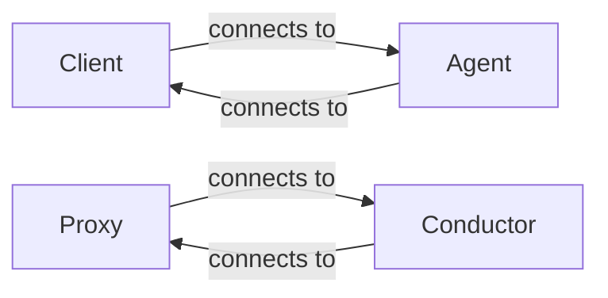
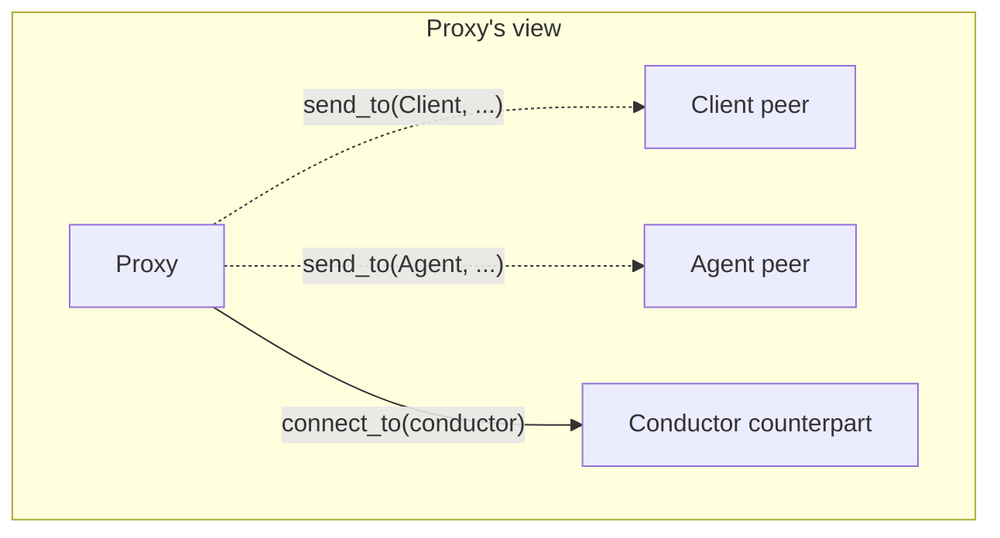
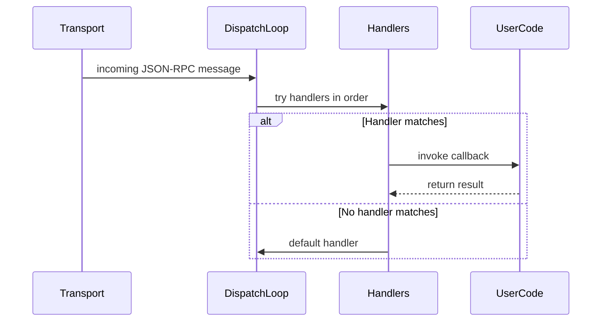
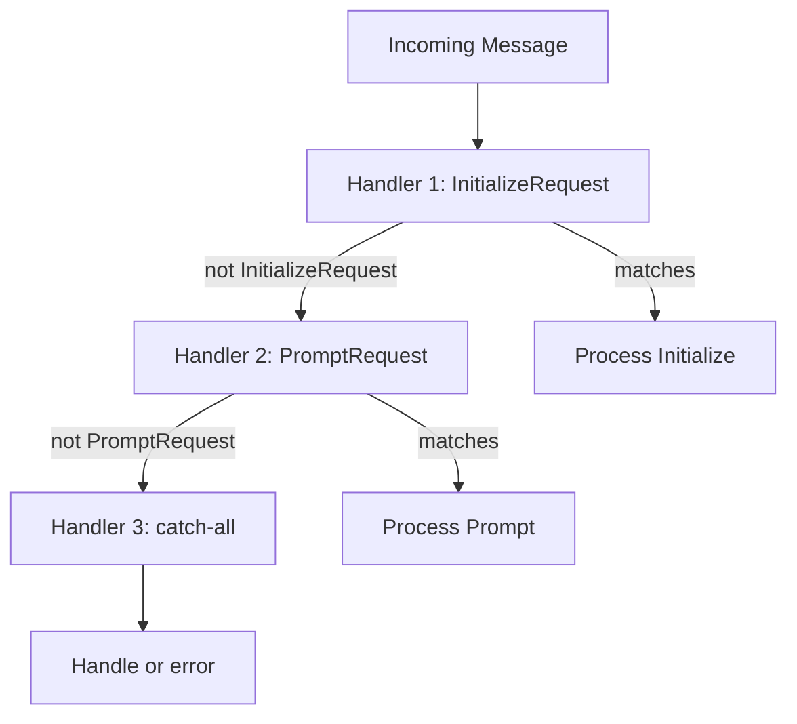
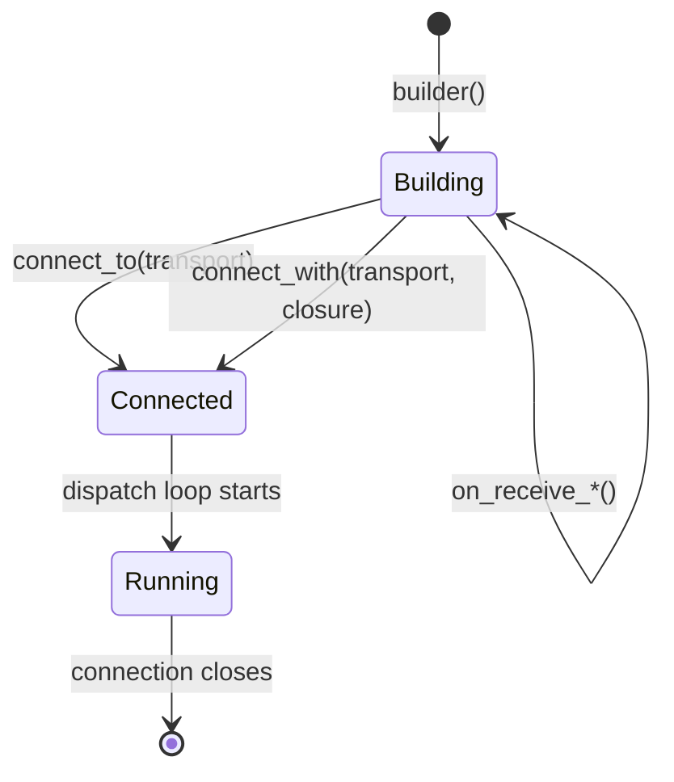

# Core Library Design

This document describes the design of the `sacp` crate and its companion crates (`sacp-tokio`, `sacp-rmcp`).

For API usage, see the [rustdoc](https://docs.rs/sacp) and [cookbook](https://docs.rs/sacp-cookbook).

## Crate Organization

### sacp

The core SDK. Provides:

- **Role types** (`Client`, `Agent`, `Proxy`, `Conductor`) - the identities in ACP
- **Connection builders** (`builder()`, `connect_to()`, `connect_with()`)
- **Message handling** (`on_receive_request`, `on_receive_notification`, `on_receive_dispatch`)
- **Protocol types** (`sacp::schema::*`) - all ACP message types
- **MCP server builder** - for adding tools to proxies

### sacp-tokio

Tokio-specific utilities:

- **Process spawning** - spawn agent/proxy processes and connect via stdio
- **Transport helpers** - convert tokio streams to sacp transports

### sacp-rmcp

Integration with the [rmcp](https://docs.rs/rmcp) crate:

- **`McpServer::from_rmcp()`** - wrap an rmcp server as an sacp MCP server

## Role System

The type system is built around **roles** - the logical identity of an endpoint.

### Counterpart Relationship

Each role has exactly one **counterpart** - who it connects to:

| Role | Counterpart |
|------|-------------|
| `Client` | `Agent` |
| `Agent` | `Client` |
| `Proxy` | `Conductor` |
| `Conductor` | `Proxy` |

This is encoded in the type system: `impl ConnectTo<Client> for MyAgent` means "MyAgent can connect to a client" (i.e., MyAgent plays the Agent role).

### Peer Relationship

Some roles can communicate with multiple **peers**. The `Proxy` role is the key example:

- **Counterpart** (Conductor) - who the proxy connects to (transport layer)
- **Peers** (Client, Agent) - who the proxy exchanges logical messages with

## Message Flow

### Dispatch Loop

Each connection runs a dispatch loop that processes incoming messages:

### Handler Chain

Handlers are tried in registration order. The first matching handler wins:

### Ordering Guarantees

The dispatch loop provides sequential processing:

1. Messages are processed one at a time
2. A handler runs to completion before the next message is processed
3. Spawned tasks (`connection.spawn()`) run concurrently with the dispatch loop

**Important**: Don't block the dispatch loop. Use `spawn()` for long-running work.

## Connection Lifecycle

### Two Connection Modes

**Reactive mode** (`connect_to`): The connection runs handlers until the transport closes. Used for agents and proxies.

**Active mode** (`connect_with`): Runs a closure with access to the connection, then closes. Used for clients that drive the interaction.

## Key Source Files

| File | Purpose |
|------|---------|
| `src/sacp/src/role.rs` | Role trait and type definitions |
| `src/sacp/src/role/acp.rs` | Client, Agent, Proxy, Conductor roles |
| `src/sacp/src/component.rs` | ConnectTo and Builder traits |
| `src/sacp/src/builder.rs` | Connection builder implementation |
| `src/sacp/src/dispatch.rs` | Dispatch type and handler matching |
| `src/sacp/src/mcp_server/` | MCP server builder |
| `src/sacp/src/concepts/` | Rustdoc concept explanations |

## Design Decisions

### Why Roles Instead of Links?

Earlier versions used "link types" that encoded both sides (e.g., `ClientToAgent`). Roles are simpler:

- One concept instead of two (role vs link)
- Role types double as peer selectors (`send_to(Agent, ...)`)
- Clearer mental model: "I am X, connecting to Y"

### Why Witness Macros?

The `on_receive_request!()` macros work around Rust's lack of return-type notation. They capture the return type of closures at the call site, enabling type inference to work.

### Why Not Traits for Handlers?

Handler closures are more ergonomic than trait implementations for most use cases. The `HandleDispatchFrom` trait exists for advanced cases (reusable handler components).
